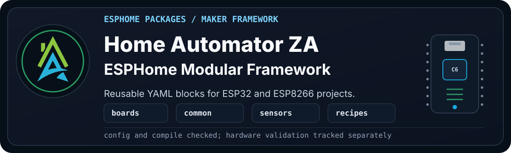
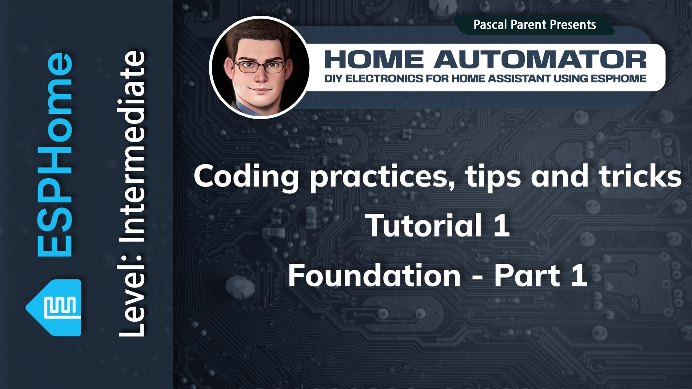

  

  
  
  
   
  
  
  
  
  

A practical best-practice framework for ESPHome that helps makers build IoT devices faster, with reusable modules, clearer patterns, less guesswork for beginners, and guidance for troubleshooting common issues.

> [!WARNING]
> **Disclaimer:** This project is shared as-is, with the usual "it works in my
> environment" honesty baked in. These files come from real builds, test
> devices, and ongoing experiments, but they are not guaranteed to work safely
> or correctly in your setup. Check the code, wiring, pins, power, secrets,
> calibration, and local rules before using anything. If it can switch mains
> power, move water, open a gate, affect safety, or ruin your afternoon, test it
> properly first.

> [!NOTE]
> The `main` branch is updated when enough work has landed on `dev` to make a
> stable public snapshot. If you want the latest bleeding-edge work, use the
> [`dev` branch](https://github.com/homeautomatorza/ESPHome-Modules/tree/dev). I
> update it regularly.

> [!IMPORTANT]
> ## Documentation Rebuild In Progress
>
> The 2026 framework rebuild is now moving onto `main`, and the documentation is
> still being rebuilt around it. The YAML modules, cookbook projects, validation
> notes, and wiki pages are being cleaned up in public as the framework settles.
>
> I am aware that the wiki is currently broken, I will fix it as soon as possible.
> Much of the current documentation was AI-assisted and is being reviewed in
> stages. Thanks for your patience.
>
> Expect some documentation gaps, draft pages, and rough edges while that work is
> underway. Start with the validated project examples first, and check each
> module's validation notes before using it in a real build.
>
> Status:
> - [ ] Wiki general pages
> - [ ] Wiki board pages
> - [ ] Wiki common component pages
> - [ ] Wiki peripheral pages
> - [ ] Wiki sensor pages
> - [ ] Wiki recipe pages
> - [ ] Internal recipe pages

---

## Look Here First

If you are new to the framework, start with a working example before reading
every folder.

| Goal | Start Here | Why |
| --- | --- | --- |
| Check requirements | [System requirements](https://github.com/homeautomatorza/ESPHome-Modules/wiki/system-requirements) | Lists the minimum ESPHome, board, editor, flashing, secrets, and substitution needs. |
| Prepare the bench | [Starter hardware](https://github.com/homeautomatorza/ESPHome-Modules/wiki/recommended-starter-hardware) and [starter tools](https://github.com/homeautomatorza/ESPHome-Modules/wiki/recommended-starter-tools) | Covers a sensible first parts box, basic test tools, soldering gear, and what can wait. |
| See a real build | [Room Sense Basic](recipes/projects/room_sense/basic/README.md) | Small room sensor project using shared board, network, and sensor packages. |
| Check the evidence | [Room Sense Basic validation](recipes/projects/room_sense/basic/validation.md) | Records config validation, compile validation, physical upload, and live sensor-value checks. |
| Browse reusable parts | [Module catalogue](https://github.com/homeautomatorza/ESPHome-Modules/wiki/module-catalogue) | Shows the boards, common packages, peripherals, and sensors as documentation is rebuilt. |
| Install the framework | [Installation guide](https://github.com/homeautomatorza/ESPHome-Modules/wiki/installation) | Covers ZIP download, local clone, and remote package use. |

The Room Sense Basic project currently carries the strongest public end-to-end
evidence. Other modules and cookbook projects are being cleaned up and
documented as the 2026 framework rebuild continues.

---

## About

As an enterprise architect, software developer, and hardware tinkerer, I found ESPHome easy to start with but harder to maintain as my devices grew. Too many projects relied on repeated copy-paste blocks, and small changes quickly became difficult to track across multiple devices.

This framework grew out of that problem. ESPHome packages made it possible to write a module once, reuse it across devices, and still add or remove features at the device file level when a project needed something different.

What started as a personal modular setup grew alongside the Home Automator ZA YouTube channel and became a passion project for anyone who wanted a more structured way to build with ESPHome. The 2026 version is being reviewed, reorganized, documented at module level, and supported by a dedicated wiki.

And yes, this is the same framework I use for my own projects, though I use the `dev` branch. That is also how
I develop the cookbook projects and sample recipes: they come from real things I
am building, cleaning up, and turning into something other people can follow.
When a module is marked as hardware validated, it is because I have used it in a
real build, not because it only passed an automated check.

Read more in the [About wiki page](https://github.com/homeautomatorza/ESPHome-Modules/wiki/about).

---

## The YouTube Channel

---

## What It Helps With

- **Reusable packages:** Put board, network, display, sensor, and peripheral
  logic in easily maintainable shared ESPHome packages instead of repeating the same YAML in every
  project.
- **Cleaner device files:** Keep project YAML focused on the device you are
  building, while common behaviour stays in one place.
- **Board-aware defaults:** Keep pins, flash settings, hardware notes, and board
  choices separate from sensors and project behaviour.
- **Cookbook projects:** Use real builds as starting points for your own
  ESPHome devices.
- **Honest validation:** Track config checks, compile checks, and physical
  hardware testing separately.

---

## Documentation

Documentation is being rebuilt alongside the 2026 framework cleanup. Start with
the [wiki home page](https://github.com/homeautomatorza/ESPHome-Modules/wiki/Home), then use the [module catalogue](https://github.com/homeautomatorza/ESPHome-Modules/wiki/module-catalogue)
and [validation guide](https://github.com/homeautomatorza/ESPHome-Modules/wiki/validation) when you need the deeper reference
material.

Some wiki pages are still draft outlines until the related modules and projects
have been reviewed.

---

## Roadmap

I am currently rebuilding my own projects against this version of the framework so they can be cleaned up, validated, and documented properly.

Once that work is further along, I will publish a public roadmap that people can vote on. In the meantime, suggestions and ideas for future [cookbook projects](recipes/projects/README.md) are welcome.

Read more in the [Roadmap wiki page](https://github.com/homeautomatorza/ESPHome-Modules/wiki/roadmap).

---

## Contributing

Contributions are welcome, especially tested modules, documentation fixes, cookbook ideas, and clear bug reports.

Please read [CONTRIBUTING.md](CONTRIBUTING.md) before opening a pull request.

---

## Issues And Questions

Found a bug, broken example, stale module, or confusing bit of documentation?

Please [open an issue](https://github.com/homeautomatorza/ESPHome-Modules/issues).
For cookbook ideas, mark the issue clearly as a cookbook suggestion. For general
discussion, use [GitHub Discussions](https://github.com/homeautomatorza/ESPHome-Modules/discussions)
when available.

> [!TIP]
> Include the board, module, ESPHome version, what you expected, and what actually happened.

> [!IMPORTANT]
> Please remove Wi-Fi details, API keys, tokens, private hostnames, and other secrets before sharing logs or YAML.

Read more in the [Bugs wiki page](https://github.com/homeautomatorza/ESPHome-Modules/wiki/bugs).

---

## Updates

Version notes, module changes, breaking changes, and rebuild progress will be tracked in the [Wiki Changelog page](https://github.com/homeautomatorza/ESPHome-Modules/wiki/changelog).

---

## Acknowledgments

- **Nabu Casa** and **The Open Home Foundation**: For supporting the open home ecosystem that makes projects like this possible.
- **The ESPHome community**: For the tools, examples, ideas, and shared knowledge that make ESPHome such a practical platform to build on.
- **My wife**: For the patience, support, and space that make it possible for me to keep working on this passion project.

---

## Licence

This project uses CC0 1.0 Universal unless a file says otherwise. Keep licence metadata in module headers aligned with the project licence unless a file has a specific reason to use different terms.

See [`LICENSE`](LICENSE) for the full licence text.

Read more in the [Licence wiki page](https://github.com/homeautomatorza/ESPHome-Modules/wiki/licence).

---

> **Trademark & Branding Notice**: CC0 applies to the project files, but it does not grant permission to use the project name, "Home Automator ZA", logos, app icons, or branding in derivative works or redistributions. Modified versions or redistributions must remove or replace official project branding.
