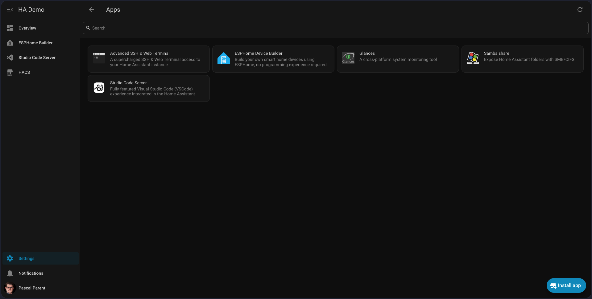
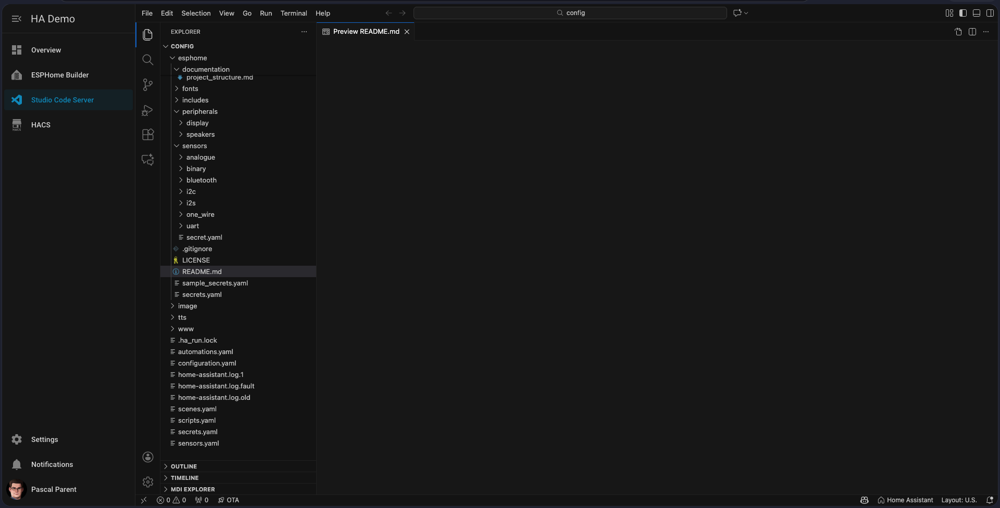
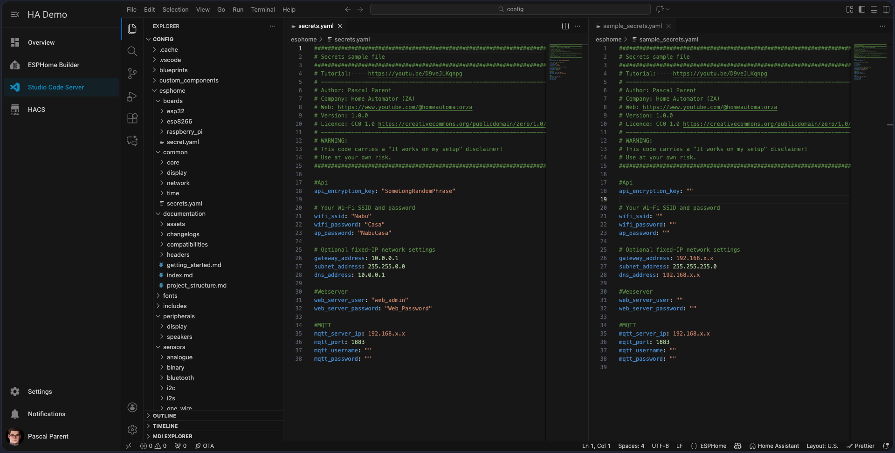
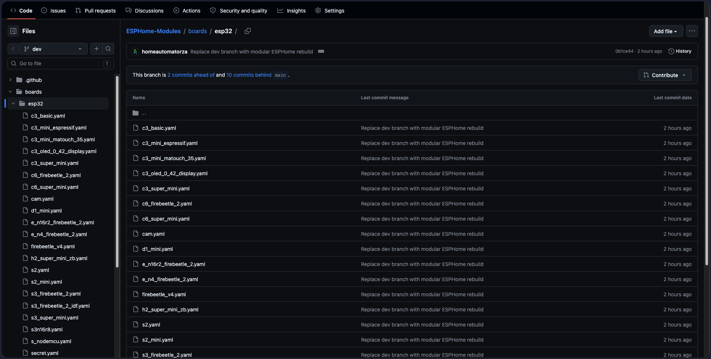
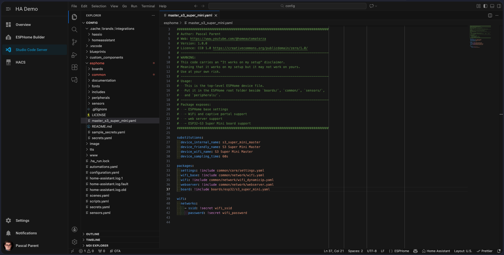
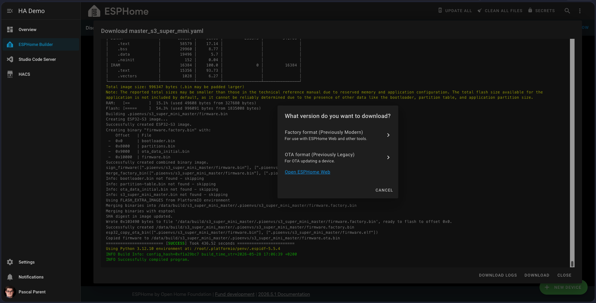

# Getting Started: From ESPHome Module To Dashboard

This guide shows the basic workflow for using the Home Automator ZA ESPHome
modules.

It is written for beginners. You do not need to understand every ESPHome option
before you start. The goal is to get one simple ESP32 device online, prove that
it talks to Home Assistant, and understand where sensors and peripherals fit
later.

## What This Repository Does

This repository contains reusable ESPHome YAML packages.

Instead of copying the same WiFi, board, logging, OTA, and sensor code into
every device file, the device file includes small reusable packages.

Think of it like building with LEGO blocks:

- one package describes the board
- one package handles core ESPHome settings
- one package handles communications like WiFi
- one package adds a sensor or peripheral
- one file, called the device file, ties those packages together

The result is a cleaner device file that is easier to read, reuse, and improve.

```text
device.yaml
  includes common/core/settings.yaml
  includes common/network/wifi_dynamicip.yaml
  includes boards/esp32/c3_super_mini.yaml
  later includes sensors/i2c/bh1750.yaml
```

## Before You Start

You need:

- Home Assistant already installed and running:
  https://youtu.be/YkyZF6oia3o
- the ESPHome add-on installed:
  https://youtu.be/zwykvV82SGw
- Studio Code Server installed and/or Visual Studio Code Desktop installed:
  https://youtu.be/oKdITXid-5Y
  https://youtu.be/6NdY1y3NYL8
- the Samba Share add-on installed, or another way to edit files in your
  ESPHome folder:
  https://youtu.be/Vu_oxefjd0I
- an ESP32 board, such as an ESP32-C3 Super Mini or ESP32-S3 Super Mini
- a USB-C data cable
- your WiFi network name and password

Recommended:

- a breadboard
- jumper wires
- a USB power meter
- a logic level shifter for 5V sensors



## Safety First

Most ESP32 boards use 3.3V logic.

That matters because some sensors are powered by 5V and may also output 5V
signals. Sending a 5V signal into an ESP32 GPIO pin can damage the board.

Before wiring a sensor:

- check the sensor voltage
- check whether the signal pin outputs 3.3V or 5V
- use a logic level shifter when a 5V signal needs to connect to an ESP32 GPIO
- double-check the board pinout before powering the circuit

> Screenshot placeholder:
> Simple breadboard photo showing ESP32 board, 3.3V rail, 5V rail, and a logic
> level shifter.

## Step 1: Get The Modules Into ESPHome

Open the ESPHome folder used by your Home Assistant ESPHome add-on.

Then copy or clone this repository into that ESPHome folder.

The important part is that the public folders are available from the ESPHome
device YAML files:

```text
boards/
common/
peripherals/
sensors/
sample_secrets.yaml
```



## Step 2: Create Your Secrets File

Do not put real WiFi passwords, API keys, or OTA passwords directly into public
YAML files.

Copy `sample_secrets.yaml` to a new file named `secrets.yaml` in the ESPHome
root folder.

Then fill in your private values.

Example:

```yaml
api_encryption_key: "your_api_encryption_key_here"
ota_password: "your_ota_password_here"

wifi_ssid: "your_wifi_name"
wifi_password: "your_wifi_password"
ap_password: "fallback_hotspot_password"

web_server_user: "admin"
web_server_password: "your_web_password"
```

Keep `secrets.yaml` private.

### API Encryption Key Choice

Many ESPHome users create a different `api_encryption_key` for each device.

In Pascal's own home setup, the same API encryption key is commonly used across
the ESPHome server. For devices that stay inside your own home network, this can
be a practical and manageable approach.

If you plan to sell, give away, or install devices for someone else, use a
different API encryption key per device. That keeps each device independent and
avoids sharing one private key across hardware you no longer fully control.



## Step 3: Choose Your Board Package

A board package describes the ESP32 board and the hardware defaults used by the
module system.

For example:

| Board | Package |
| --- | --- |
| ESP32-C3 Super Mini | `boards/esp32/c3_super_mini.yaml` |
| ESP32-S3 Super Mini | `boards/esp32/s3_super_mini.yaml` |

Use the compatibility documentation before choosing a board:

- [Board compatibility](compatibilities/boards.md)
- [Peripheral compatibility](compatibilities/peripherals/README.md)
- [Sensor compatibility](compatibilities/sensors/README.md)



## Step 4: Create A Master Device File

Create a new ESPHome device YAML file.

For this first test, keep it simple. The master device file should only include:

- substitutions
- common settings
- WiFi
- web server
- board package

Starter master files are available here:

- [ESP32-C3 Super Mini starter file](assets/getting_started/starter_files/master_c3_super_mini.yaml)
- [ESP32-S3 Super Mini starter file](assets/getting_started/starter_files/master_s3_super_mini.yaml)

Example for an ESP32-S3 Super Mini:

```yaml
substitutions:
  device_internal_name: bedroom_sensor_hub
  device_friendly_name: Bedroom Sensor Hub
  device_wifi_name: Bedroom Sensor Hub
  device_sampling_time: 60s

packages:
  settings: !include common/core/settings.yaml
  wifi: !include common/network/wifi_dynamicip.yaml
  webserver: !include common/network/webserver.yaml
  board: !include boards/esp32/s3_super_mini.yaml
```

Example for an ESP32-C3 Super Mini:

```yaml
substitutions:
  device_internal_name: desk_sensor_hub
  device_friendly_name: Desk Sensor Hub
  device_wifi_name: Desk Sensor Hub
  device_sampling_time: 60s

packages:
  settings: !include common/core/settings.yaml
  wifi: !include common/network/wifi_dynamicip.yaml
  webserver: !include common/network/webserver.yaml
  board: !include boards/esp32/c3_super_mini.yaml
```

The C3 and S3 examples are almost identical. The main difference is the board
package.



## Step 5: Validate And Compile

Open the ESPHome dashboard.

Find your device and run validation or compile.

The first compile for a board usually takes longer than later compiles. ESPHome
may download platform tools, framework files, and other build dependencies for
that specific board. Some sensors or peripherals can also trigger extra
downloads the first time they are used.

This is normal. Let the first compile finish unless ESPHome shows a clear error.

If ESPHome reports an error:

- read the first error message carefully
- check indentation
- check that the package path exists
- check that `secrets.yaml` contains the required keys
- check that the board package matches your real board

When compile succeeds, the device is ready to upload.



## Step 6: Upload To The ESP32

Connect the ESP32 to your computer or Home Assistant host with a USB data cable.

Upload the compiled firmware from ESPHome.

If the board is not detected or flashing fails, try boot mode:

1. Unplug the USB cable.
2. Hold the `BOOT` button on the board.
3. Plug the USB cable back in.
4. Release the `BOOT` button.
5. Try the upload again.

After upload, the ESP32 should restart and connect to WiFi.

If it cannot connect, ESPHome normally starts a fallback WiFi hotspot so you can
recover the device.

> Screenshot placeholder:
> ESPHome upload screen or log showing the device flashing successfully.

## Step 7: Confirm The Device In Home Assistant

Once the device is online, Home Assistant should discover it.

Open:

```text
Settings -> Devices & services
```

Then find the ESPHome device.

At this stage, you are checking that:

- the device appears in Home Assistant
- the native API connection works
- diagnostic entities are present
- the device stays online

> Screenshot placeholder:
> Home Assistant ESPHome device page showing the new device and its entities.

## Step 8: Build A Simple Dashboard Check

Before adding sensors, create a small dashboard panel to prove the device is
working.

Good first cards:

- a light card for the onboard RGB LED, if the board has one
- a graph card for internal temperature
- an entities card for uptime, WiFi signal, or status

This dashboard is not meant to be beautiful yet. It is a quick confidence check.

If the dashboard updates when the board changes, Home Assistant and ESPHome are
talking correctly.

> Screenshot placeholder:
> Simple dashboard with device status, uptime, internal temperature, and onboard
> LED controls.

## Step 9: Add One Sensor At A Time

Once the master file works, add one sensor package.

Do not add five sensors at once when learning. Add one, compile, upload, and
test it.

Example:

```yaml
packages:
  settings: !include common/core/settings.yaml
  wifi: !include common/network/wifi_dynamicip.yaml
  webserver: !include common/network/webserver.yaml
  board: !include boards/esp32/s3_super_mini.yaml
  bh1750: !include
    file: sensors/i2c/bh1750.yaml
    vars:
      i2c_address: 0x23
```

After adding a sensor:

- compile again
- upload again
- check the ESPHome logs
- check the new Home Assistant entities
- add the new entity to the dashboard

> Screenshot placeholder:
> Example sensor package being added to the master YAML.

## Understanding Compatibility Status

Compatibility status is used to show how far each module has been checked.

| Status | Meaning |
| --- | --- |
| Not tested | No ESPHome compilation has been done in this rebuild. |
| Needs validation | AI-assisted review and ESPHome compilation/config validation found no blocking errors, but the package has not been validated on physical hardware by a person. |
| Experimental | In active development. It is expected to compile and might work, but behaviour is still being proven. |
| Tested | Validated on physical hardware. The ESPHome version used for validation must be recorded. |

AI-assisted validation helps catch mistakes early, but it does not replace human
hardware testing.

## Common Beginner Problems

### ESPHome Cannot Find A Package

Check the include path.

This:

```yaml
board: !include boards/esp32/s3_super_mini.yaml
```

only works if `boards/` is in the same ESPHome root folder as your device YAML.

### WiFi Fails

Check:

- `wifi_ssid` in `secrets.yaml`
- `wifi_password` in `secrets.yaml`
- whether the device is close enough to the access point
- whether your WiFi network is 2.4 GHz

### The Board Will Not Flash

Try boot mode:

1. Unplug USB.
2. Hold `BOOT`.
3. Plug USB back in.
4. Release `BOOT`.
5. Upload again.

Also check that the USB-C cable supports data.

### The First Compile Takes A Long Time

This is usually normal.

On the first compile, ESPHome may need to download tools and framework files for
the selected board. The first compile after adding a new sensor or peripheral
can also take longer if extra libraries are needed.

After those files are downloaded, later compiles are usually faster.

### A Sensor Gives Bad Values

Check:

- the sensor voltage
- the GPIO pin
- pull-up or pull-down requirements
- I2C address
- UART TX/RX direction
- whether the sensor needs calibration

### Nothing Appears In Home Assistant

Check:

- the ESPHome logs
- whether the device is on WiFi
- whether Home Assistant discovered the device
- whether API encryption matches
- whether the device and Home Assistant are on the same network

## Where To Go Next

After the master device file works:

1. Pick one sensor from the compatibility list.
2. Wire only that sensor.
3. Add only that sensor package.
4. Compile and upload.
5. Confirm the Home Assistant entity.
6. Add the entity to a dashboard.

That is the pattern for the whole Sensor to Dashboard workflow.

Small steps are easier to debug, easier to document, and safer for the hardware.
