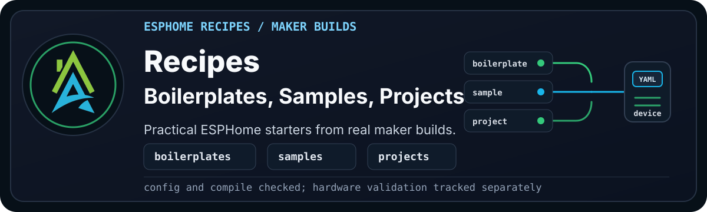

  

> [!WARNING]
> **Disclaimer:** These files are shared as-is, with the usual "it works in my
> environment" honesty baked in. They come from real builds, test
> devices, and ongoing experiments, but they are not guaranteed to work safely
> or correctly in your setup. Check the code, wiring, pins, power, secrets,
> calibration, and local rules and regulations before using anything. If it can
> switch mains power, move water, open a gate, affect safety, or ruin your
> afternoon, test it properly first.

Recipes are practical starting points for using the HAZA ESPHome Modular
Framework in real ESPHome projects.

They are where the framework becomes less abstract: a board, a few shared
packages, a sensor or two, and a device file that shows how the pieces fit
together.

## What You'll Find Here

This folder is split into three lanes: clean starting points, focused
experiments, and complete cookbook builds.

## Start Here

| Goal | Start Here | Why |
| --- | --- | --- |
| Start with a board | [Boilerplates](boilerplates/README.md) | Clean starter YAML files for common ESP32 boards. |
| See a full build | [Projects](projects/README.md) | Cookbook builds that show the framework working as a real device. |
| Learn one idea | [Samples](samples/README.md) | Focused examples for one sensor, pattern, or small experiment. |

Projects are the main end-to-end examples. Samples are smaller and more
experimental. Boilerplates are the clean starting point when you already know
what you want to build.

Current validation evidence lives beside each project. Room Sense Basic carries
its own hardware notes, and SmartPad EM32 has joined the cookbook as an OTA,
web, and log-smoke-tested smart plug migration while relay, button, LED,
known-load metering, overload, and longer Bluetooth stability checks continue.

BH1750 illuminance and Wi-Fi signal labels have both been OTA revalidated after
their label updates.

If you are new to the framework, start with a
[boilerplate](boilerplates/README.md) and work through the
[installation guide](../wiki/installation.md) before moving to a sample or
project.
