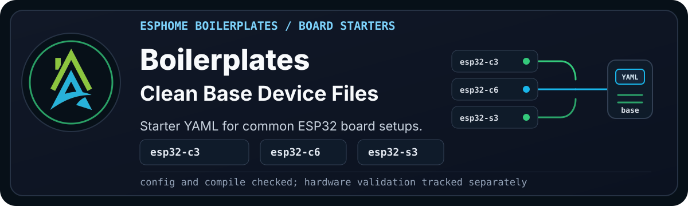

  

> [!WARNING]
> **Disclaimer:** These files are shared as-is, with the usual "it works in my
> environment" honesty baked in. They come from real builds, test
> devices, and ongoing experiments, but they are not guaranteed to work safely
> or correctly in your setup. Check the code, wiring, pins, power, secrets,
> calibration, and local rules and regulations before using anything. If it can
> switch mains power, move water, open a gate, affect safety, or ruin your
> afternoon, test it properly first.

Boilerplates are starter YAML files for common ESPHome board setups.

Use these when you want a clean base device file and plan to add your own
sensors, peripherals, naming, networking, and project logic.

New to this flow? Start with the
[boilerplate quick start](../../wiki/boilerplate-quick-start.md) before picking
a board file.

## Available Boilerplates

| Board | Variant | File |
| --- | --- | --- |
| Espressif ESP32-C3 Super Mini v1 F4/P0 | ESP32-C3 | [esphome_c3_f4p0_super_mini_boilerplate.yaml](esphome_c3_f4p0_super_mini_boilerplate.yaml) |
| DFRobot FireBeetle 2 ESP32-C6 v1.0 F4/P0 | ESP32-C6 | [esphome_c6_f4p0_firebeetle_2_boilerplate.yaml](esphome_c6_f4p0_firebeetle_2_boilerplate.yaml) |
| Super Mini ESP32-C6 v1.0 F4/P0 | ESP32-C6 | [esphome_c6_f4p0_super_mini_boilerplate.yaml](esphome_c6_f4p0_super_mini_boilerplate.yaml) |
| DFRobot FireBeetle 2 ESP32-E N4 F4/P0 | ESP32-E | [esphome_esp32_f4p0_firebeetle_2_e_boilerplate.yaml](esphome_esp32_f4p0_firebeetle_2_e_boilerplate.yaml) |
| DFRobot FireBeetle 2 ESP32-E N16R2 F16/P2 | ESP32-E | [esphome_esp32_f16p2_firebeetle_2_e_boilerplate.yaml](esphome_esp32_f16p2_firebeetle_2_e_boilerplate.yaml) |
| Espressif ESP32-S3 Super Mini v2 F4/P2 | ESP32-S3 | [esphome_s3_f4p2_super_mini_v2_boilerplate.yaml](esphome_s3_f4p2_super_mini_v2_boilerplate.yaml) |
| DFRobot FireBeetle 2 ESP32-S3 N16R8 F16/P8 | ESP32-S3 | [esphome_s3_f16p8_firebeetle_2_boilerplate.yaml](esphome_s3_f16p8_firebeetle_2_boilerplate.yaml) |

## Naming Note

The `F` and `P` values describe the board memory layout used by the
boilerplate name:

- `F` means flash memory, so `F4` means 4 MB flash and `F16` means 16 MB flash.
- `P` means PSRAM, so `P0` means no PSRAM, `P2` means 2 MB PSRAM, and `P8`
  means 8 MB PSRAM.
