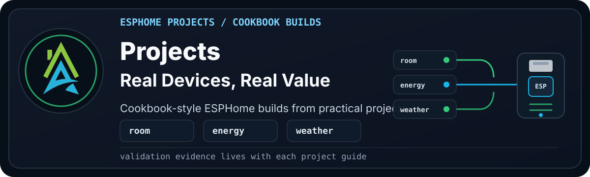

  

> [!WARNING]
> **Disclaimer:** These files are shared as-is, with the usual "it works in my
> environment" honesty baked in. They come from real builds, test
> devices, and ongoing experiments, but they are not guaranteed to work safely
> or correctly in your setup. Check the code, wiring, pins, power, secrets,
> calibration, and local rules and regulations before using anything. If it can
> switch mains power, move water, open a gate, affect safety, or ruin your
> afternoon, test it properly first.

Projects are cookbook-style ESPHome builds that show how framework packages fit
together in a real device.

## Look Here First

| Goal | Start Here | Why |
| --- | --- | --- |
| Build the first available project | [HAZA Room Sense Basic](room_sense/basic/README.md) | Small room sensor using shared board, network, and sensor packages. |
| Check validation evidence | [Room Sense Basic validation](room_sense/basic/validation.md) | Shows what passed config, compile, physical upload, and live-value checks. |
| Troubleshoot that build | [Room Sense Basic troubleshooting](room_sense/basic/troubleshooting.md) | Captures known setup, wiring, and runtime checks for the first project. |
| Browse future families | [Available and Future Projects](#available-and-future-projects) | Shows planned project families without treating them as finished builds. |

## Status Words

| Status | Meaning |
| --- | --- |
| Available | Public documentation and project files exist. Check the project page for exact validation evidence. |
| Beta | Project files exist and automated validation may pass, but physical validation is still pending or incomplete. |
| Coming soon | Intended project or variant, but not ready as a public build guide yet. |
| Planned | A direction for the framework, not a build claim. |

## Available and Future Projects

### [Room Sense Series](room_sense/README.md)

The Room Sense series is for understanding how a room feels and changes over
time. The first project starts small with temperature, humidity, and light.
Later variants add air quality, particulate sensing, movement, and presence
when those signals are useful.

| Project | Status | What It Adds |
| --- | --- | --- |
| [Room Sense Basic](room_sense/basic/README.md) | Available | Temperature, humidity, dew point, and illuminance. |
| [Room Sense Plus](room_sense/plus/README.md) | Beta | Basic plus eCO2 and TVOC. |
| Room Sense Air | Coming soon | Plus plus PM2.5 or particulate sensing. |
| Room Sense Presence | Coming soon | Movement and presence focused sensing. |
| Room Sense Tracker | Coming soon | Bluetooth-based person tracking or room presence experiments. |
| Room Sense Max | Coming soon | Reserved for the full combined room sensor. |
| Room Remote | Coming soon | IR blaster project for controlling room devices such as TVs, fans, sound systems, or air conditioners. |

Room Sense is the sensing ladder. Room Remote is kept separate because it is a
control project, not a room-monitoring sensor. It can still use Room Sense data
later, but its main job is sending IR commands to existing room devices.

### Tank Sense Series (Planned)

The Tank Sense series is for larger stored-water tanks. It answers practical
household or utility questions: how much water is available, whether the tank
has reached a critical state, and what the stored water temperature is.

| Project | Status | Intended Direction |
| --- | --- | --- |
| Tank Sense Basic | Planned | Tank level, critical-level sensor, and tank water temperature. |
| Tank Sense Plus | Planned | Basic plus a tank water flow meter. |

Tank Sense is kept separate from Hydro Sense because it is about stored-water
availability and protection, not hydroponics or plant-growing conditions.

### Utilities Series (Planned)

The Utilities series is for standalone household utility monitoring where the
main job is measuring usage rather than building a larger control system.

| Project | Status | Intended Direction |
| --- | --- | --- |
| Water Flow Basic | Planned | Utility water flow meter for tracking real-time flow and usage. |
| Power Meter Basic | Planned | Power meter for tracking real-time electricity usage. |

### Energy Series (Planned)

The Energy series is for inverter, plug-load, and power-system monitoring
projects. It includes both larger integrations, such as Sunsynk Modbus, and
smaller conversions that bring useful switching and power data into the
framework.

| Project | Status | Intended Direction |
| --- | --- | --- |
| Sunsynk Link | Planned | Modbus project for real-time Sunsynk inverter data and supported control commands. |
| Smartpad Basic | Planned | Smartpad smart plug conversion with switch control and power monitoring. |
| Smartpad Tracker | Planned | Smartpad Basic plus Bluetooth-based person tracking. |

Sunsynk Link is more than a passive reader, so the name leaves room for both
monitoring and carefully scoped control.

Smartpad conversions should be treated as mains-powered projects. Document the
exact smart plug model, internal wiring, safety limits, and validation evidence
before publishing a build guide.

### Relay Control Series (Planned)

The Relay Control series is for ESPHome conversions that switch existing
circuits or trigger existing controllers. The wiring and safety assumptions
change from device to device, so each build needs careful documentation.

| Project | Status | Intended Direction |
| --- | --- | --- |
| Access Relay | Planned | Sonoff SV conversion for low-voltage gate and garage door control. |
| Sonoff Switch Basic | Planned | Sonoff Basic conversion for controlling lights, fans, or other suitable switched loads. |

Gate and garage door projects must respect the original controller safety
features, limit switches, obstruction detection, and local regulations. Sonoff
Basic conversions should be treated as mains-powered projects and documented
with the exact model, load limits, wiring, enclosure, and validation evidence.

### Hydro Sense Series (Planned)

The Hydro Sense series is planned for hydroponics and water-based growing
systems. It will focus on the measurements that help keep a reservoir stable
and plants healthy.

| Project | Status | Intended Direction |
| --- | --- | --- |
| Hydro Sense Basic | Planned | Starting point for water and environment monitoring. |
| Hydro Sense Plus | Planned | Adds more reservoir or plant-care signals. |
| Hydro Sense Max | Planned | Reserved for the fuller hydroponics monitoring build. |

### Weather Sense Series (Planned)

The Weather Sense series is planned for local weather and outdoor environment
monitoring. It should stay practical: useful outdoor readings first, then more
advanced measurements when the hardware and validation are ready.

| Project | Status | Intended Direction |
| --- | --- | --- |
| Weather Sense Basic | Planned | Starting point for local outdoor weather readings. |
| Weather Sense Plus | Planned | Adds more weather or environmental signals. |
| Weather Sense Max | Planned | Reserved for the fuller weather station build. |

### Media Series (Planned)

The Media series is planned for voice, audio, and Home Assistant interaction.
These projects are intentionally separate from Room Sense so sensing projects do
not become crowded with speakers, microphones, or media logic.

| Project | Status | Intended Direction |
| --- | --- | --- |
| Voice Basic | Planned | Voice-only Home Assistant interaction. |
| Voice Plus | Planned | Voice interaction with stereo music output. |
| Music Basic | Planned | Mono audio output. |
| Music Plus | Planned | Stereo audio output. |
