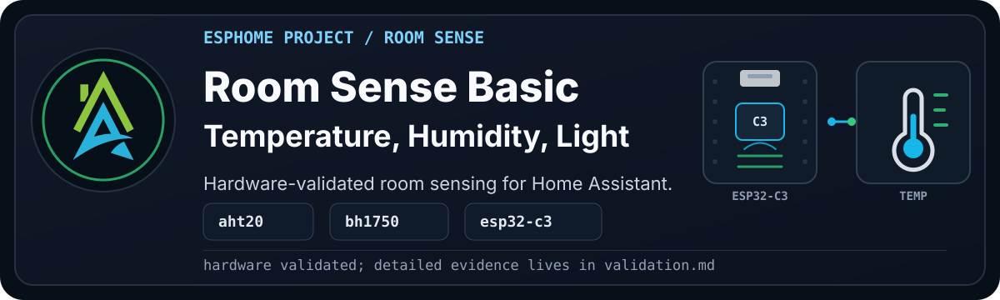
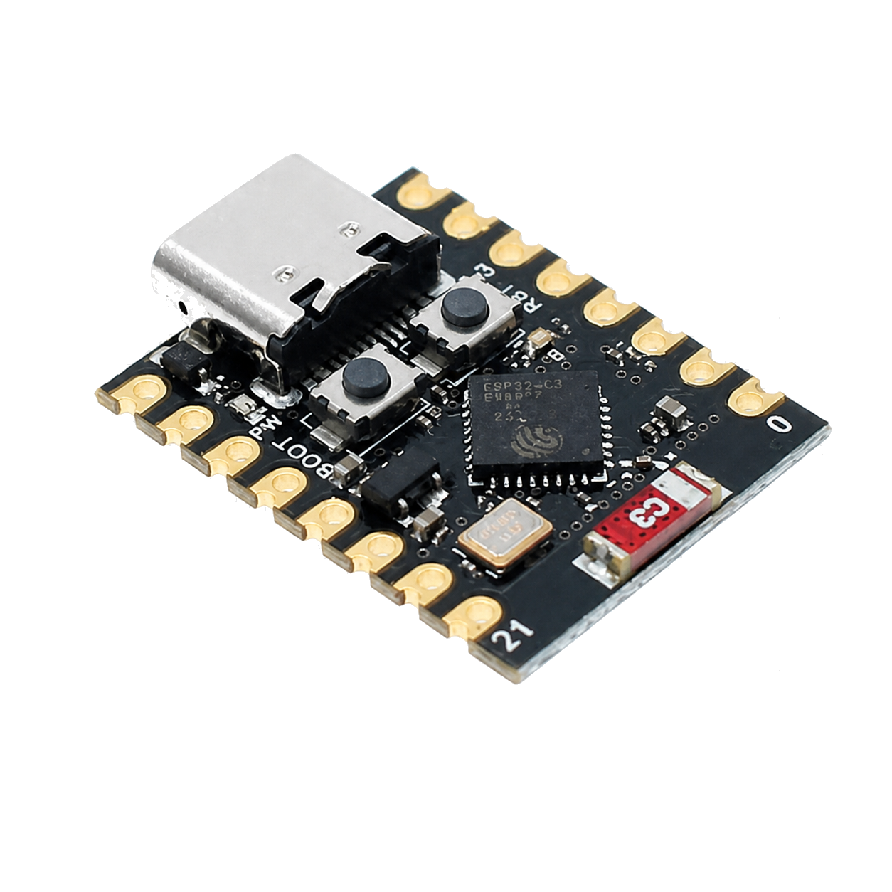
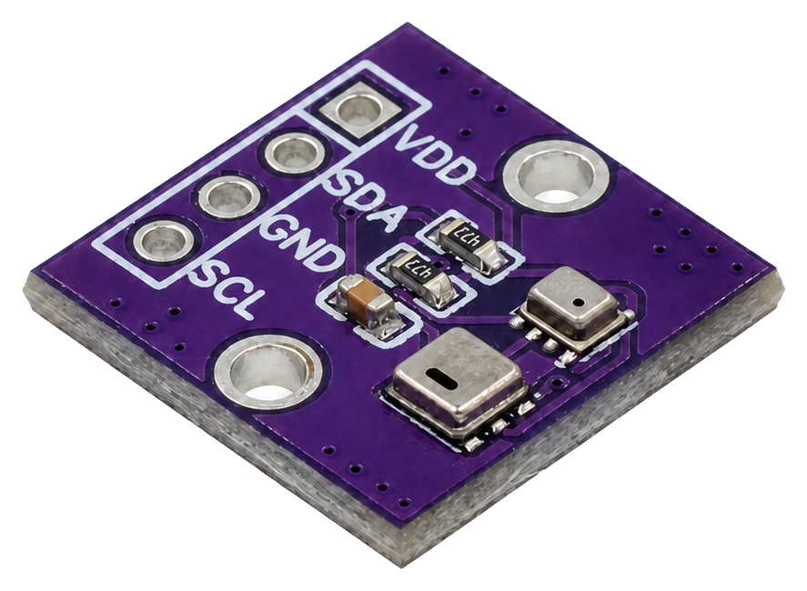
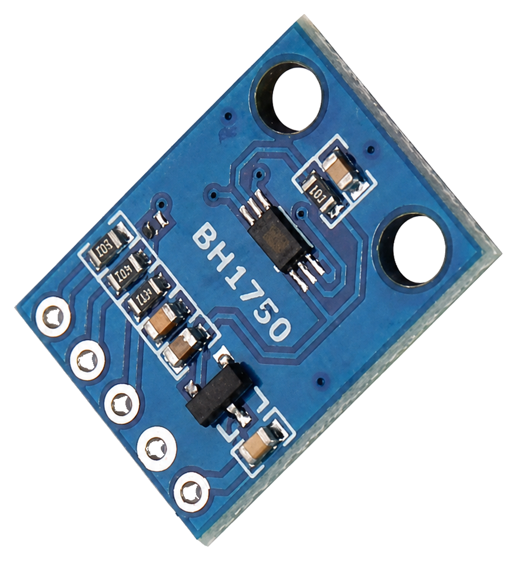
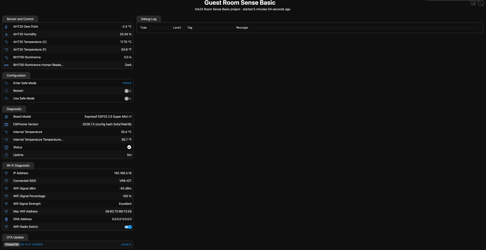
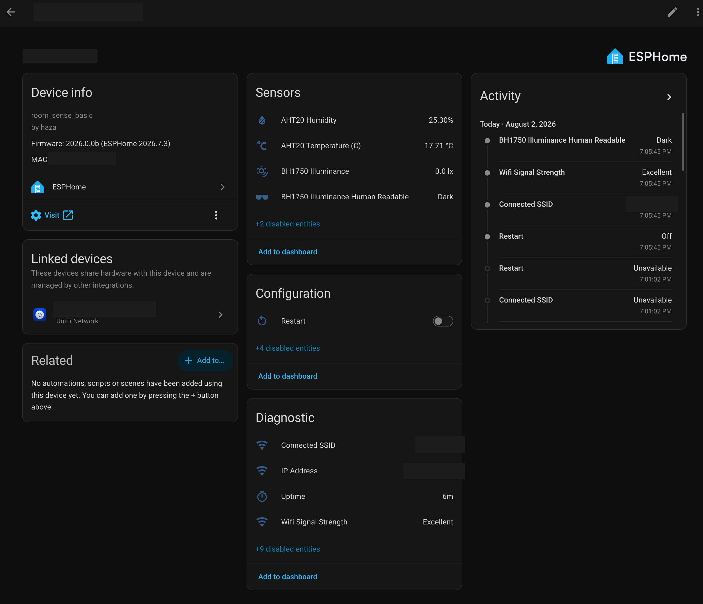

<p align="center">
  
</p>

> [!WARNING]
> **Disclaimer:** These files are shared as-is, with the usual "it works in my
> environment" honesty baked in. They come from real builds, test
> devices, and ongoing experiments, but they are not guaranteed to work safely
> or correctly in your setup. Check the code, wiring, pins, power, secrets,
> calibration, and local rules and regulations before using anything. If it can
> switch mains power, move water, open a gate, affect safety, or ruin your
> afternoon, test it properly first.

> [!TIP]
> This project is the starting point for the `Room Sense Series` of devices. You
> can build this one now and expand it as your needs and budget grow. If you
> intend to add sensors later, I strongly advise starting with this [Room Sense
> Plus configuration](../plus/esphome_room_sense_plus_project_alternate.yaml)
> and using an ESP32-C6.

The `Room Sense Basic` is the simplest useful room sensor we could come up with.
It measures the environmental conditions that quietly shape how a room feels:
temperature, humidity, and light.

<details>

<summary><b>Current Status</b></summary><br>

- YAML recipe:
  [`esphome_room_sense_basic_project.yaml`](esphome_room_sense_basic_project.yaml)
- Config validation: Passed on ESPHome `2026.7.3`
- Compile validation: Passed on ESPHome `2026.7.3`
- Physical validation: Passed on `Room Sense Basic validation device`,
  2026-08-02
- Documentation approval: Pending

Full validation notes live in [validation.md](documents/validation.md).

</details>

## Project Profile

| Factor | Rating | Notes |
| --- | --- | --- |
| Difficulty | Beginner to intermediate | Basic wiring, ESPHome compile/upload, and Home Assistant integration. |
| Estimated cost | Low | Uses a small ESP32-C3 board and two common I2C sensors. |
| Build time | 1-2 hours | Faster if the headers and pins are already soldered and ESPHome is ready. |
| Tools needed | Basic | USB data cable, jumper wires, a breadboard, and a computer. |
| Off-the-shelf viability | Either | Many off-the-shelf products do this. Build if you want to learn how to make your own IoT devices with local control and repairability, or want a base for future variants. |
| Maintenance burden | Low | Check readings occasionally; no regular calibration is expected for Room Sense Basic. |

> [!TIP]
> You may need to solder headers onto the ESP32 and sensor boards. A good
> soldering iron, solder, flux, and a desoldering pump are worth having. See
> [Recommended Starter Hardware](https://github.com/homeautomatorza/ESPHome-Modules/wiki/recommended-starter-hardware)
> in the Wiki for more information.

## Why Build This?

Most rooms are not uncomfortable all at once. They drift.

The room gets a little warmer, a little more humid, or a little darker, and by
the time you notice it you are already uncomfortable or the plants are already
having a less-than-great day.

This project gives Home Assistant a simple view of the room so that we can make
useful automations that have real value.

## What Problems It Solves

- Shows the current temperature and humidity in a room.
- Shows how bright or dark the room is.
- Gives Home Assistant real values instead of guesses.
- Creates a reusable base for room comfort, plant care, and lighting logic.
- Gives us a small hardware-tested project to validate framework modules.

## What Possibilities It Creates

This project does not control anything by itself. It is the sensing layer.

Once the values are in Home Assistant, they can become inputs for things like:

- turning an air conditioner, heater, humidifier, or dehumidifier on and off
- understanding whether a room is comfortable at different times of day
- checking whether plants are sitting in useful light
- deciding when a blind, curtain, fan, or extractor might help
- feeding future Room Sense variants with air quality, particulate, or presence
  data

The Basic version keeps the first step small enough that it is easy to build,
test, and trust.

## Hardware And Bill Of Materials

| Item | Recommended Part | Image | Alternates |
| --- | --- | --- | --- |
| Controller | ESP32-C3 Super Mini |  | Any other suitable ESP32 |
| Temperature and humidity | AHT20 module |  | BME280, SHT30, AHT10 |
| Illuminance | BH1750 module |  | VEML7700, TSL2561 |
| From the electronics workshop | Jumper wires, breadboard, and USB data cable | [Recommended starter hardware](https://github.com/homeautomatorza/ESPHome-Modules/wiki/recommended-starter-hardware) | |

> [!WARNING]
> The alternatives in this table are not drop-in replacements. Changing the
> board or either sensor may require a different framework package, GPIO mapping,
> I2C address, wiring layout, voltage check, or enclosure. Keep the pinout and
> module documentation nearby, then validate, compile, and test the changed
> hardware before relying on it.

## Who This Is For

Build this if you want a small room sensor that is easy to understand and extend,
or if this is your first foray into the world of ESPHome and electronics.

It is especially useful if you are:

- learning ESPHome with reusable packages.
- building your first room sensor based on my framework.
- starting a room comfort or plant-care automation.
- validating the ESP32-C3 Super Mini.

Skip it, or use it only as a reference, if you need a polished commercial
device, battery operation, presence detection, eCO2/TVOC, or PM2.5 in this
version.

## Wiring

```text
[Image placeholder: assets/fritzing.png]
```

Use the wiring table when checking the diagram.

| Component | Pin | Connects to ESP32 | Notes |
| --- | --- | --- | --- |
| AHT20 | VCC | 3V3 | Use 3.3 V unless your module explicitly supports another voltage. |
| AHT20 | GND | GND | Common ground with the ESP32-C3. |
| AHT20 | SDA | GPIO9 | I2C SDA from `boards/esp32/c3_super_mini.yaml`. |
| AHT20 | SCL | GPIO10 | I2C SCL from `boards/esp32/c3_super_mini.yaml`. |
| BH1750 | VCC | 3V3 | Use 3.3 V unless your module explicitly supports another voltage. |
| BH1750 | GND | GND | Common ground with the ESP32-C3. |
| BH1750 | SDA | GPIO9 | Shared I2C bus. |
| BH1750 | SCL | GPIO10 | Shared I2C bus. |

> [!WARNING]
> Power and safety notes:
> - Always check the output voltage from your sensors. ESP32 GPIO uses 3.3 V
>   logic; use a [level shifter](https://github.com/homeautomatorza/ESPHome-Modules/wiki/using-a-level-shifter)
>   if a sensor outputs a higher voltage.
> - Disconnect power before changing wiring.
> - GPIO9 is a strapping pin on the ESP32-C3 Super Mini, so keep the wiring simple
>   and check boot behavior after wiring.
> - If I2C scanning does not find both sensors, check power, ground, SDA/SCL
>   order, and sensor addresses first.
> - Keep the AHT20 exposed to room air and the BH1750 exposed to representative
>   room light.

> [!TIP]
> I2C devices can share the same SDA and SCL lines. Use one wire colour for SDA
> (for example, purple) and another for SCL (for example, yellow). It avoids
> confusion and possible damage from crossed wires. I also use red for positive
> and black for negative power.

## Setup

1. Copy or import the
   [recipe YAML](esphome_room_sense_basic_project.yaml).
2. Set the device substitutions for your room.
    ```yaml
    substitutions:
      device_internal_name: john_bedroom_sense_basic
      device_wifi_name: john-bedroom-sense-basic
      device_friendly_name: John's Bedroom Sense Basic
      device_sampling_time: 30s
    ```
3. Confirm that `sample_secrets.yaml` has the required secret names in your own
   `secrets.yaml`.
4. Validate the configuration in ESPHome.
5. Compile the firmware.
6. Erase the old flash and perform the first USB serial upload by following
   [First Firmware Upload](https://github.com/homeautomatorza/ESPHome-Modules/wiki/first-firmware-upload).
7. Check the ESPHome logs and web server.
8. Add or review the device in Home Assistant.

<details>

<summary><b>Framework Packages Used</b></summary><br>

- Board: `boards/esp32/c3_super_mini.yaml`
- Core: `common/core/settings.yaml`
- Time: `common/time/home_assistant.yaml`
- Wi-Fi helpers: `common/network/wifi.yaml`
- Wi-Fi dynamic IP: `common/network/wifi_dynamicip.yaml`
- Web server: `common/network/webserver.yaml`
- BH1750 sensor: `sensors/i2c/bh1750.yaml`
- AHT20 sensor: `sensors/i2c/aht2x_3x.yaml`

</details>

## Visual Checks

### ESPHome Web Server

> [!TIP]
> From ESPHome 2026.6 or newer, you can access the device web server from ESPHome
> Device Builder. See
> [Finding Your Way Around ESPHome](https://github.com/homeautomatorza/ESPHome-Modules/wiki/esphome-ui-primer).



Use this screen to confirm the device is alive locally and the ESPHome-side
values look sensible before spending time debugging Home Assistant.

## Home Assistant Entities

<details>

<summary><b>Expected user-facing entities</b></summary><br>

Enabled by default:

- AHT20 Temperature (C)
- AHT20 Humidity
- BH1750 Illuminance
- BH1750 Illuminance Human Readable
- Uptime
- IP Address
- Connected SSID
- Wifi Signal Strength
- Status and diagnostic entities, depending on what Home Assistant shows by
  default

Disabled by default:

- AHT20 Temperature (F)
- AHT20 Dew Point
- ESP32 internal temperature entities
- Board Model and other optional diagnostic entities

You can enable disabled entities from the device page in Home Assistant when
you need them.

The exact entity IDs depend on the device substitutions used for the local
deployment.

</details>

### Home Assistant Device Page



Use this screen to confirm the device integrated correctly and the expected
entities are visible in Home Assistant.

### Additional Images To Add

```text
[Image placeholder: close-up of assembled board and sensors]
```

## Calibration And Tuning

No calibration is expected for the Basic version.

That said, sensor placement matters:

- Do not mount the AHT20 directly against a heat source.
- Do not trap the AHT20 in a sealed enclosure.
- Do not point the BH1750 at a light source unless that is the measurement you
  actually want.
- Compare readings with another trusted room sensor if the values feel wrong.

## Validation Evidence

See [validation.md](documents/validation.md).

## Troubleshooting

See [troubleshooting.md](documents/troubleshooting.md).

## Changelog

See [changelog.md](documents/changelog.md).

## Related Projects And Next Variants

- HAZA Room Sense Plus: Basic plus eCO2 and TVOC.
- HAZA Room Sense Air: Plus plus PM2.5 or particulate sensing.
- HAZA Room Sense Presence: movement and presence focused variant.
- HAZA Room Sense Max: reserved for the full combined room sensor.
