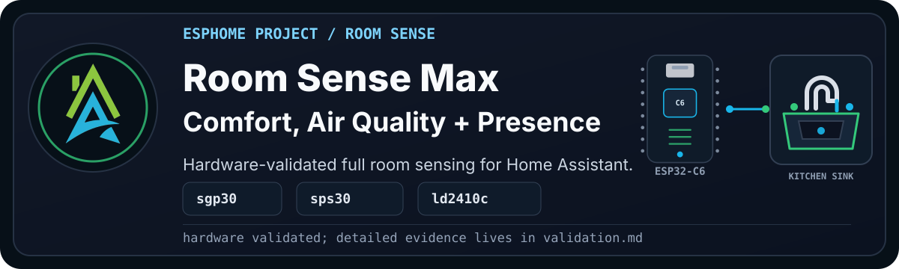

<p align="center">
  
</p>

> [!WARNING]
> **Disclaimer:** This is the combined Room Sense build. It has passed config,
> compile, serial upload, OTA upload, log checks, and web checks on one private
> validation device. That is real evidence, not a universal guarantee. It still
> carries the normal "it works in my environment" caution until more people
> build it.

`HAZA Room Sense Max` is the full Room Sense build: comfort, light, indoor-air
signals, particulate matter, PIR movement, mmWave presence, and a combined room
occupancy state.

This is the version for a room where the extra sensors are worth the wiring,
space, power, and setup time.

<details>

<summary><b>Current Status</b></summary><br>

- YAML recipe: `esphome_room_sense_max_project.yaml`
- Board: ESP32-C6 Super Mini for this validation device
- Current stage: Hardware-validated
- Config validation: Passed with ESPHome 2026.7.3
- Compile validation: Passed with ESPHome 2026.7.3 for the public recipe and
  local Desktop App file; Pascal's hardware validation used ESPHome 2026.7.4
- Physical validation: Passed with serial push and OTA upload on 2026-08-17
- Live validation: Passed with log check and web check on 2026-08-17
- Documentation approval: Draft, pending Pascal review

Full validation notes live in [validation.md](documents/validation.md).

</details>

## Project Profile

| Factor | Rating | Notes |
| --- | --- | --- |
| Difficulty | Advanced | The build combines multiple I2C sensors, PIR, UART radar, power planning, placement, and tuning. |
| Estimated cost | High | It includes the complete Room Sense sensor stack. |
| Build time | A weekend | Build and validate it in stages rather than wiring everything at once. |
| Tools needed | Soldering and test gear | A USB data cable, breadboard, jumper wires, and a multimeter are strongly recommended. |
| Off-the-shelf viability | Better to build | The value is the unusual local sensor combination and transparent ESPHome integration. |
| Maintenance burden | Medium to high | Airflow, sensor drift, radar tuning, and the larger wiring stack need occasional attention. |

> [!TIP]
> See [Recommended Starter Hardware](https://github.com/homeautomatorza/ESPHome-Modules/wiki/recommended-starter-hardware)
> and [Recommended Starter Tools](https://github.com/homeautomatorza/ESPHome-Modules/wiki/recommended-starter-tools).

## Why Build This?

Room Sense Max is the "give me the full picture" room sensor.

Basic tells us temperature, humidity, dew point, and light. Plus adds eCO2 and
TVOC. Air adds particulate matter. Motion and Presence show whether the room is
being used. Max combines those signals so one device can help with comfort,
ventilation, lighting, air-quality decisions, and occupancy-aware automations.

It is more hardware than every room needs. That is the point of the Room Sense
ladder: start small, then only build Max where the extra information is useful.

## What Problems It Solves

- Combines room comfort, light, gas estimates, particulates, movement, and presence.
- Reduces the number of separate room devices and integrations to maintain.
- Keeps the raw signals available when the combined occupancy state needs diagnosis.

## What Possibilities It Creates

- Occupancy-aware ventilation, lighting, and climate decisions.
- Comparisons between activity, comfort, particulate levels, and gas estimates.
- One advanced platform for testing how a room behaves over time.

## Staged Build Plan

| Stage | Adds | Status |
| --- | --- | --- |
| 1 | ESP32-C6 Super Mini, BH1750, BME280 | Inherited from hardware-validated Room Sense Basic/Air baseline |
| 2 | SGP30 eCO2 and TVOC | Inherited from hardware-validated Plus/Air stages |
| 3 | SPS30 particulate matter | Inherited from hardware-validated Air stage |
| 4 | HC-SR501 PIR movement | Inherited from hardware-validated Motion/Presence baseline |
| 5 | HLK-LD2410C mmWave presence | Inherited from hardware-validated Presence stage |
| 6 | Combined `Room Occupancy` state | Hardware validated on 2026-08-17 |

## Hardware And Bill Of Materials

| Item | Recommended Part | Image | Viable Alternatives | Notes |
| --- | --- | --- | --- | --- |
| Controller | ESP32-C6 Super Mini | To do: `assets/esp32-c6-super-mini.png` | Other ESP32-C6 boards | Pin mapping and board package may change. |
| Temperature, humidity, and pressure | BME280 module | To do: `assets/bme280-sensor.png` | BMP280 | BMP280 does not expose humidity and needs a different package. |
| Illuminance | BH1750 module | To do: `assets/bh1750-sensor.png` | Other ESPHome-supported lux sensors | Wiring and package will change. |
| eCO2 and TVOC | SGP30 module | To do: `assets/sgp30-sensor.png` | ENS160, CCS811 | Alternatives need different packages and interpretation. |
| Particulate matter | SPS30 module | To do: `assets/sps30-sensor.png` | PMSx003 family | Wiring, airflow, and placement matter. |
| Movement | HC-SR501 PIR sensor | To do: `assets/hc-sr501-pir.png` | Other GPIO PIR modules | Delay and sensitivity are usually adjusted on the module itself. |
| Presence | HLK-LD2410C mmWave sensor | To do: `assets/hlk-ld2410c.png` | Other LD2410 variants | UART pins and GPIO presence pin must match the project YAML. |

> [!WARNING]
> Alternatives are not automatically drop-in replacements. A changed part can
> affect power, GPIO or UART mapping, I2C addresses, packages, airflow,
> placement, enclosure fit, and calibration. Revalidate the build one stage at
> a time.

## Who This Is For

Build Max if you already understand the smaller Room Sense variants and need
the full signal set in one room. Start with Basic, Plus, Air, Motion, or Presence
if you want a simpler build or only need part of this capability.

## Wiring

Pascal will provide the Fritzing diagram after the combined hardware check.

```text
[Image placeholder: assets/wiring-breadboard.png]
```

Current validation wiring:

| Component | Pin | Connects To | Notes |
| --- | --- | --- | --- |
| BH1750 | VCC | 3V3 | Use 3.3V unless your module explicitly supports another voltage. |
| BH1750 | GND | GND | Common ground with the ESP32-C6. |
| BH1750 | SDA | GPIO14 | I2C SDA from `boards/esp32/c6_super_mini.yaml`. |
| BH1750 | SCL | GPIO18 | I2C SCL from `boards/esp32/c6_super_mini.yaml`. |
| BME280 | VCC | 3V3 | Use 3.3V unless your module explicitly supports another voltage. |
| BME280 | GND | GND | Common ground with the ESP32-C6. |
| BME280 | SDA | GPIO14 | Shared I2C bus. |
| BME280 | SCL | GPIO18 | Shared I2C bus. |
| SGP30 | VCC | 3V3 | Uses BME280 temperature and humidity compensation. |
| SGP30 | GND | GND | Common ground with the ESP32-C6. |
| SGP30 | SDA | GPIO14 | Shared I2C bus. |
| SGP30 | SCL | GPIO18 | Shared I2C bus. |
| SPS30 | VCC | Module-safe supply | Check your SPS30 board or cable. |
| SPS30 | GND | GND | Common ground with the ESP32-C6. |
| SPS30 | SDA | GPIO14 | Shared I2C bus. |
| SPS30 | SCL | GPIO18 | Shared I2C bus. |
| HC-SR501 | VCC | Module-safe supply | Check your PIR module voltage requirements. |
| HC-SR501 | GND | GND | Common ground with the ESP32-C6. |
| HC-SR501 | OUT | GPIO1 | Matches the validation wiring pattern. |
| HLK-LD2410C | VCC | Module-safe supply | Check your LD2410C module voltage requirements. |
| HLK-LD2410C | GND | GND | Common ground with the ESP32-C6. |
| HLK-LD2410C | OUT | GPIO0 | GPIO presence output. |
| HLK-LD2410C | RX | GPIO3 | ESP32-C6 UART TX to LD2410C RX. |
| HLK-LD2410C | TX | GPIO4 | ESP32-C6 UART RX from LD2410C TX. |

Expected I2C addresses:

- BH1750: `0x23`
- SGP30: `0x58`
- SPS30: `0x69`
- BME280: `0x76`

## Setup

1. Copy or import the [recipe YAML](esphome_room_sense_max_project.yaml).
2. Review every substitution, GPIO, UART pin, sensor address, and power requirement.
3. Confirm the required secret names exist in your own `secrets.yaml`.
4. Validate and compile the smallest wired stage first.
5. For a new or repurposed board, follow [First Firmware Upload](https://github.com/homeautomatorza/ESPHome-Modules/wiki/first-firmware-upload).
6. Add one sensor stage at a time, checking logs and the web server after each change.
7. Test moving, still, occupied, empty, and air-quality states before building automations.
8. Add or review the device in Home Assistant.

<details>

<summary><b>Framework Packages Used</b></summary><br>

- Board: `boards/esp32/c6_super_mini.yaml`
- Core: `common/core/settings.yaml`
- Time: `common/time/home_assistant.yaml`
- Network helpers: `common/network/wifi.yaml`
- Public recipe network: `common/network/wifi_dynamicip.yaml`
- Web server: `common/network/webserver.yaml`
- Sensor: `sensors/i2c/bh1750.yaml`
- Sensor: `sensors/i2c/bme280.yaml`
- Sensor: `sensors/i2c/sgp30.yaml`
- Sensor: `sensors/i2c/sps30.yaml`
- Binary sensor: `sensors/binary/hc_sr501.yaml`
- UART sensor: `sensors/uart/hlk_ld2410c_minimal.yaml`

</details>

## Visual Checks

To add during documentation cleanup:

```text
[Image placeholder: ESPHome web server view for Room Sense Max]
[Image placeholder: Home Assistant device page for Room Sense Max]
[Image placeholder: close-up of the C6, BH1750, BME280, SGP30, SPS30, PIR, and LD2410C wiring]
[Image placeholder: Fritzing wiring diagram]
```

## Home Assistant Entities

<details>

<summary><b>Expected user-facing entities</b></summary><br>

Expected user-facing entities for the current stage:

- BME280 Temperature (C)
- BME280 Humidity
- BME280 Atmospheric Pressure
- BME280 Dew Point
- BH1750 Illuminance
- BH1750 Illuminance Human Readable
- SGP30 eCO2
- SGP30 eCO2 Classification
- SGP30 TVOC
- SGP30 TVOC Level
- SPS30 PM <1um Weight concentration
- SPS30 PM <2.5um Weight concentration
- SPS30 PM <4um Weight concentration
- SPS30 PM <10um Weight concentration
- SPS30 Fan Clean
- HC-SR501 Movement
- LD2410 GPIO Presence
- LD2410 Presence
- LD2410 Moving Target
- LD2410 Still Target
- Room Occupancy
- Uptime
- IP Address
- Connected SSID
- Wifi Signal Strength

The exact entity IDs depend on the device substitutions used for the local
deployment.

</details>

## Calibration And Tuning

Treat tuning as several smaller jobs. Check environmental sensor placement,
keep the SPS30 airflow path clear, allow the SGP30 to establish a useful
baseline, adjust the PIR in its final position, and tune the LD2410C only after
testing moving, still, and empty-room states.

## Validation Evidence

See [validation.md](documents/validation.md).

## Troubleshooting

See [troubleshooting.md](documents/troubleshooting.md).

## Changelog

See [changelog.md](documents/changelog.md).

## Related Projects And Next Variants

- Room Sense Basic for the smallest useful build.
- Room Sense Plus and Air for air-focused variants.
- Room Sense Motion and Presence for occupancy-focused variants.
