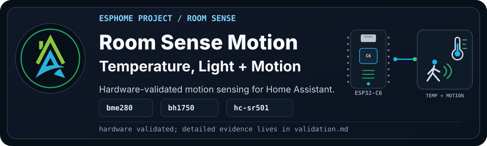

<p align="center">
  
</p>

> [!WARNING]
> **Disclaimer:** This project is being built from a real wired Study device.
> It passed on that validation device, but it still carries the normal
> "it works in my environment" warning until more builds have repeated it.

`HAZA Room Sense Motion` is the PIR-only movement variant in the Room Sense
family.

It starts from the same comfortable-room baseline as Room Sense Basic: BME280
for temperature, humidity, pressure, and dew point, plus BH1750 for illuminance.
Then it adds a simple HC-SR501 PIR sensor for movement.

<details>

<summary><b>Current Status</b></summary><br>

- YAML recipe: `esphome_room_sense_motion_project.yaml`
- Board: ESP32-C6 Super Mini for this validation device
- Likely future board: ESP32-C3 for a smaller PIR-focused build
- Current stage: C6 PIR hardware validation passed
- Config validation: Passed with ESPHome 2026.7.3
- Compile validation: Passed with ESPHome 2026.7.3 on 2026-08-17
- Physical validation: Passed with ESPHome 2026.7.4 on 2026-08-17
- Documentation approval: Draft, pending Pascal review

Full validation notes live in [validation.md](documents/validation.md).

</details>

## Project Profile

| Factor | Rating | Notes |
| --- | --- | --- |
| Difficulty | Intermediate | I2C wiring is straightforward, but PIR power, placement, delay, and sensitivity need attention. |
| Estimated cost | Low to medium | Uses common room sensors and an inexpensive PIR module. |
| Build time | 2-3 hours | Allow time to tune the PIR and check false triggers. |
| Tools needed | Basic soldering and test gear | A USB data cable, jumper wires, a breadboard, and a small screwdriver are useful. |
| Off-the-shelf viability | Either | Buy for a compact finished device; build for local control and flexible automation signals. |
| Maintenance burden | Low | Recheck PIR placement and sensitivity if the room layout changes. |

> [!TIP]
> See [Recommended Starter Hardware](https://github.com/homeautomatorza/ESPHome-Modules/wiki/recommended-starter-hardware)
> and [Recommended Starter Tools](https://github.com/homeautomatorza/ESPHome-Modules/wiki/recommended-starter-tools).

## Why Build This?

Room Sense Motion answers a simple question: did something move in the room?

That sounds basic, but it is useful. Motion can turn lights on, keep a room
active in Home Assistant, help decide whether a space is being used, or act as a
low-cost input for comfort automations.

This project deliberately stops at PIR. The LD2410C belongs in the later
Presence variant, where we can talk properly about still presence, UART wiring,
and the difference between movement and occupancy.

## What Problems It Solves

- Adds a simple movement signal to room comfort and light readings.
- Gives Home Assistant a local trigger for lighting and room-use automations.
- Keeps PIR movement separate from the stronger claim of continuous presence.

## What Possibilities It Creates

- Motion-assisted lighting that also considers room brightness.
- Room activity history alongside temperature and humidity.
- A tested stepping stone to the Room Sense Presence variant.

## Staged Build Plan

| Stage | Adds | Status |
| --- | --- | --- |
| 1 | ESP32-C6 Super Mini, BH1750, BME280, HC-SR501 PIR | Hardware validated on the C6 Study validation device |
| 2 | ESP32-C3 variant | Planned |
| 3 | LD2410C presence | Separate Presence project |

## Hardware And Bill Of Materials

| Item | Recommended Part | Image | Viable Alternatives | Notes |
| --- | --- | --- | --- | --- |
| Controller | ESP32-C6 Super Mini | To do: `assets/esp32-c6-super-mini.png` | ESP32-C3 Super Mini | The C6 is used here because the validation device is already wired. A C3 is probably enough for a PIR-focused build. |
| Temperature, humidity, and pressure | BME280 module | To do: `assets/bme280-sensor.png` | BMP280 | BMP280 does not expose humidity and needs a different package. |
| Illuminance | BH1750 module | To do: `assets/bh1750-sensor.png` | Other ESPHome-supported lux sensors | Wiring and package will change. |
| Movement | HC-SR501 PIR sensor | To do: `assets/hc-sr501-pir.png` | Other GPIO PIR modules | Delay and sensitivity are usually adjusted on the module itself. |

> [!WARNING]
> Alternatives are not automatically drop-in replacements. Check voltage,
> output logic, GPIO mapping, package changes, placement, and tuning before
> relying on a different board or PIR module.

## Who This Is For

Build this if you need an inexpensive movement signal and want to understand
the difference between room motion and room presence. Use Room Sense Basic if
you only need environmental readings, or Presence if detecting someone sitting
still matters.

## Wiring

Pascal will provide the Fritzing diagram after the staged hardware check.

```text
[Image placeholder: assets/wiring-breadboard.png]
```

Current validation wiring:

| Component | Pin | Connects To | Notes |
| --- | --- | --- | --- |
| BH1750 | VCC | 3V3 | Use 3.3V unless your module explicitly supports another voltage. |
| BH1750 | GND | GND | Common ground with the ESP32-C6. |
| BH1750 | SDA | GPIO14 | I2C SDA from `boards/esp32/c6_super_mini.yaml`. |
| BH1750 | SCL | GPIO18 | I2C SCL from `boards/esp32/c6_super_mini.yaml`. |
| BME280 | VCC | 3V3 | Use 3.3V unless your module explicitly supports another voltage. |
| BME280 | GND | GND | Common ground with the ESP32-C6. |
| BME280 | SDA | GPIO14 | Shared I2C bus. |
| BME280 | SCL | GPIO18 | Shared I2C bus. |
| HC-SR501 | VCC | Module-safe supply | Check your PIR module voltage requirements. |
| HC-SR501 | GND | GND | Common ground with the ESP32-C6. |
| HC-SR501 | OUT | GPIO1 | Matches the previous Study wiring. |

Expected I2C addresses:

- BH1750: `0x23`
- BME280: `0x76`

## Setup

1. Copy or import the [recipe YAML](esphome_room_sense_motion_project.yaml).
2. Review the device substitutions and confirm the PIR GPIO matches your wiring.
3. Confirm the required secret names exist in your own `secrets.yaml`.
4. Validate the configuration, then compile the firmware.
5. For a new or repurposed board, follow [First Firmware Upload](https://github.com/homeautomatorza/ESPHome-Modules/wiki/first-firmware-upload).
6. Check logs and the web server, then walk-test the PIR from several directions.
7. Add or review the device in Home Assistant.

<details>

<summary><b>Framework Packages Used</b></summary><br>

- Board: `boards/esp32/c6_super_mini.yaml`
- Core: `common/core/settings.yaml`
- Time: `common/time/home_assistant.yaml`
- Network helpers: `common/network/wifi.yaml`
- Public recipe network: `common/network/wifi_dynamicip.yaml`
- Web server: `common/network/webserver.yaml`
- Sensor: `sensors/i2c/bh1750.yaml`
- Sensor: `sensors/i2c/bme280.yaml`
- Binary sensor: `sensors/binary/hc_sr501.yaml`

</details>

## Visual Checks

To add during documentation cleanup:

```text
[Image placeholder: ESPHome web server view for Room Sense Motion stage 1]
[Image placeholder: Home Assistant device page for Room Sense Motion stage 1]
[Image placeholder: close-up of the C6, BH1750, BME280, and PIR wiring]
[Image placeholder: Fritzing wiring diagram]
```

## Home Assistant Entities

<details>

<summary><b>Expected user-facing entities</b></summary><br>

Expected user-facing entities for the current stage:

- BME280 Temperature (C)
- BME280 Humidity
- BME280 Atmospheric Pressure
- BME280 Dew Point
- BH1750 Illuminance
- BH1750 Illuminance Human Readable
- HC-SR501 Movement
- Uptime
- IP Address
- Connected SSID
- Wifi Signal Strength

The exact entity IDs depend on the device substitutions used for the local
deployment.

</details>

## Calibration And Tuning

Adjust the HC-SR501 delay and sensitivity on the module, then test it in the
final position. Keep it away from moving curtains, direct sunlight, warm air
flows, and other common sources of false triggers. Place the BME280 away from
board heat and expose the BH1750 to representative room light.

## Validation Evidence

See [validation.md](documents/validation.md).

## Troubleshooting

See [troubleshooting.md](documents/troubleshooting.md).

## Changelog

See [changelog.md](documents/changelog.md).

## Related Projects And Next Variants

- Room Sense Basic for environmental sensing without movement.
- Room Sense Presence for PIR plus mmWave still-presence sensing.
- Room Sense Max for the full room-sensing stack.
