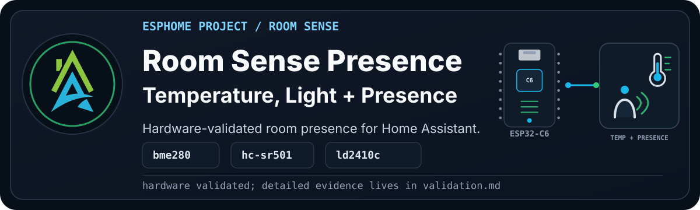

<p align="center">
  
</p>

> [!WARNING]
> **Disclaimer:** This project has been validated on one private test device.
> It works in my environment, with LD2410C presence observed, but you still need
> to check your own wiring, placement, radar sensitivity, and room behaviour.

`HAZA Room Sense Presence` is the Room Sense variant that compares movement and
presence.

It starts from the same comfortable-room baseline as Room Sense Basic: BME280
for temperature, humidity, pressure, and dew point, plus BH1750 for illuminance.
It keeps the HC-SR501 PIR from Room Sense Motion, then adds the HLK-LD2410C so
we can see the difference between movement and still presence.

<details>

<summary><b>Current Status</b></summary><br>

- YAML recipe: `esphome_room_sense_presence_project.yaml`
- Board: ESP32-C6 Super Mini for this validation device
- Current stage: Hardware validated
- Config validation: Passed with ESPHome 2026.7.3
- Compile validation: Passed with ESPHome 2026.7.3
- Physical validation: Passed with ESPHome 2026.7.4 on 2026-08-17
- Live validation: Serial push, log check, web check, and presence-observed
  check passed
- Documentation approval: Draft, pending Pascal review

Full validation notes live in [validation.md](documents/validation.md).

</details>

## Project Profile

| Factor | Rating | Notes |
| --- | --- | --- |
| Difficulty | Intermediate to advanced | The build combines I2C, PIR, UART, and mmWave placement and tuning. |
| Estimated cost | Medium | The LD2410C adds cost but provides still-presence information. |
| Build time | Half a day | Allow time for wiring, radar placement, and sensitivity testing. |
| Tools needed | Soldering and basic test gear | A USB data cable, breadboard, jumper wires, and a multimeter are useful. |
| Off-the-shelf viability | Either | Buy for simpler setup; build for transparent local signals and custom occupancy logic. |
| Maintenance burden | Medium | Radar sensitivity may need adjustment when furniture or room use changes. |

> [!TIP]
> See [Recommended Starter Hardware](https://github.com/homeautomatorza/ESPHome-Modules/wiki/recommended-starter-hardware)
> and [Recommended Starter Tools](https://github.com/homeautomatorza/ESPHome-Modules/wiki/recommended-starter-tools).

## Why Build This?

Room Sense Presence answers a more useful question than Motion alone: is the
room occupied, even when nobody is waving an arm around?

PIR movement is good at detecting change. It is less good when someone sits
still at a desk or on a couch. The LD2410C adds mmWave presence detection, which
can keep a room active even when movement has stopped.

This project keeps both signals visible. The PIR remains useful, the LD2410C
adds still-presence data, and the project adds a combined `Room Occupancy`
entity for automations that only need the practical yes/no answer.

## What Problems It Solves

- Detects likely occupancy when a person is present but not moving enough for PIR.
- Keeps raw movement, radar presence, and combined occupancy signals visible.
- Gives Home Assistant a practical room-occupancy entity without hiding the inputs.

## What Possibilities It Creates

- Lighting and climate automations that remain active while someone sits still.
- Side-by-side tuning of PIR movement and mmWave presence.
- A reusable occupancy baseline for the Room Sense Max build.

## Staged Build Plan

| Stage | Adds | Status |
| --- | --- | --- |
| 1 | ESP32-C6 Super Mini, BH1750, BME280, HC-SR501 PIR | Inherited from hardware-validated Motion baseline |
| 2 | HLK-LD2410C UART presence sensor | Hardware validated with presence observed |
| 3 | Combined `Room Occupancy` state | Hardware validated true when PIR or LD2410C GPIO presence is true |

## Hardware And Bill Of Materials

| Item | Recommended Part | Image | Viable Alternatives | Notes |
| --- | --- | --- | --- | --- |
| Controller | ESP32-C6 Super Mini | To do: `assets/esp32-c6-super-mini.png` | ESP32-C3 Super Mini | The C6 is used here because the validation device is already wired. A C3 is probably enough for a PIR-focused build. |
| Temperature, humidity, and pressure | BME280 module | To do: `assets/bme280-sensor.png` | BMP280 | BMP280 does not expose humidity and needs a different package. |
| Illuminance | BH1750 module | To do: `assets/bh1750-sensor.png` | Other ESPHome-supported lux sensors | Wiring and package will change. |
| Movement | HC-SR501 PIR sensor | To do: `assets/hc-sr501-pir.png` | Other GPIO PIR modules | Delay and sensitivity are usually adjusted on the module itself. |
| Presence | HLK-LD2410C mmWave sensor | To do: `assets/hlk-ld2410c.png` | Other LD2410 variants | UART pins and GPIO presence pin must match the project YAML. |

> [!WARNING]
> Alternatives are not automatically drop-in replacements. Check voltage,
> UART and GPIO mapping, framework packages, radar controls, placement, and
> tuning before relying on a changed build.

## Who This Is For

Build this if PIR-only movement misses people sitting at a desk or on a couch,
and you are comfortable tuning a radar sensor. Use Motion if movement is enough,
or start with Basic if this is your first ESPHome sensor build.

## Wiring

Pascal will provide the Fritzing diagram after the staged hardware check.

```text
[Image placeholder: assets/wiring-breadboard.png]
```

Current validation wiring:

| Component | Pin | Connects To | Notes |
| --- | --- | --- | --- |
| BH1750 | VCC | 3V3 | Use 3.3V unless your module explicitly supports another voltage. |
| BH1750 | GND | GND | Common ground with the ESP32-C6. |
| BH1750 | SDA | GPIO14 | I2C SDA from `boards/esp32/c6_super_mini.yaml`. |
| BH1750 | SCL | GPIO18 | I2C SCL from `boards/esp32/c6_super_mini.yaml`. |
| BME280 | VCC | 3V3 | Use 3.3V unless your module explicitly supports another voltage. |
| BME280 | GND | GND | Common ground with the ESP32-C6. |
| BME280 | SDA | GPIO14 | Shared I2C bus. |
| BME280 | SCL | GPIO18 | Shared I2C bus. |
| HC-SR501 | VCC | Module-safe supply | Check your PIR module voltage requirements. |
| HC-SR501 | GND | GND | Common ground with the ESP32-C6. |
| HC-SR501 | OUT | GPIO1 | Matches the previous Study wiring. |
| HLK-LD2410C | VCC | Module-safe supply | Check your LD2410C module voltage requirements. |
| HLK-LD2410C | GND | GND | Common ground with the ESP32-C6. |
| HLK-LD2410C | OUT | GPIO0 | GPIO presence output. |
| HLK-LD2410C | RX | GPIO3 | ESP32-C6 UART TX to LD2410C RX. |
| HLK-LD2410C | TX | GPIO4 | ESP32-C6 UART RX from LD2410C TX. |

Expected I2C addresses:

- BH1750: `0x23`
- BME280: `0x76`

## Setup

1. Copy or import the [recipe YAML](esphome_room_sense_presence_project.yaml).
2. Review the device substitutions, UART pins, and LD2410C GPIO presence pin.
3. Confirm the required secret names exist in your own `secrets.yaml`.
4. Validate the configuration, then compile the firmware.
5. For a new or repurposed board, follow [First Firmware Upload](https://github.com/homeautomatorza/ESPHome-Modules/wiki/first-firmware-upload).
6. Check logs and the web server, then test moving, still, occupied, and empty states.
7. Add or review the device in Home Assistant.

<details>

<summary><b>Framework Packages Used</b></summary><br>

- Board: `boards/esp32/c6_super_mini.yaml`
- Core: `common/core/settings.yaml`
- Time: `common/time/home_assistant.yaml`
- Network helpers: `common/network/wifi.yaml`
- Public recipe network: `common/network/wifi_dynamicip.yaml`
- Web server: `common/network/webserver.yaml`
- Sensor: `sensors/i2c/bh1750.yaml`
- Sensor: `sensors/i2c/bme280.yaml`
- Binary sensor: `sensors/binary/hc_sr501.yaml`
- UART sensor: `sensors/uart/hlk_ld2410c_minimal.yaml`

</details>

## Visual Checks

To add during documentation cleanup:

```text
[Image placeholder: ESPHome web server view for Room Sense Presence LD2410C stage]
[Image placeholder: Home Assistant device page for Room Sense Presence]
[Image placeholder: close-up of the C6, BH1750, BME280, PIR, and LD2410C wiring]
[Image placeholder: Fritzing wiring diagram]
```

## Home Assistant Entities

<details>

<summary><b>Expected user-facing entities</b></summary><br>

Expected user-facing entities for the current stage:

- BME280 Temperature (C)
- BME280 Humidity
- BME280 Atmospheric Pressure
- BME280 Dew Point
- BH1750 Illuminance
- BH1750 Illuminance Human Readable
- HC-SR501 Movement
- LD2410 GPIO Presence
- LD2410 Presence
- LD2410 Moving Target
- LD2410 Still Target
- Room Occupancy
- Uptime
- IP Address
- Connected SSID
- Wifi Signal Strength

The exact entity IDs depend on the device substitutions used for the local
deployment.

</details>

## Calibration And Tuning

Mount the LD2410C in its final position before tuning it. Test moving, still,
and empty-room states, then adjust its gates and sensitivity only as needed.
Tune the PIR separately so the combined `Room Occupancy` entity remains easy to
diagnose when one sensor behaves unexpectedly.

## Validation Evidence

See [validation.md](documents/validation.md).

Automated and physical validation passed on `2026-08-17`. The radar stayed in a
room with a person present, so the no-presence state was not captured in the
same evidence set.

## Troubleshooting

See [troubleshooting.md](documents/troubleshooting.md).

## Changelog

See [changelog.md](documents/changelog.md).

## Related Projects And Next Variants

- Room Sense Motion for PIR-only movement sensing.
- Room Sense Basic for the environmental baseline.
- Room Sense Max for presence plus the full air-quality stack.
