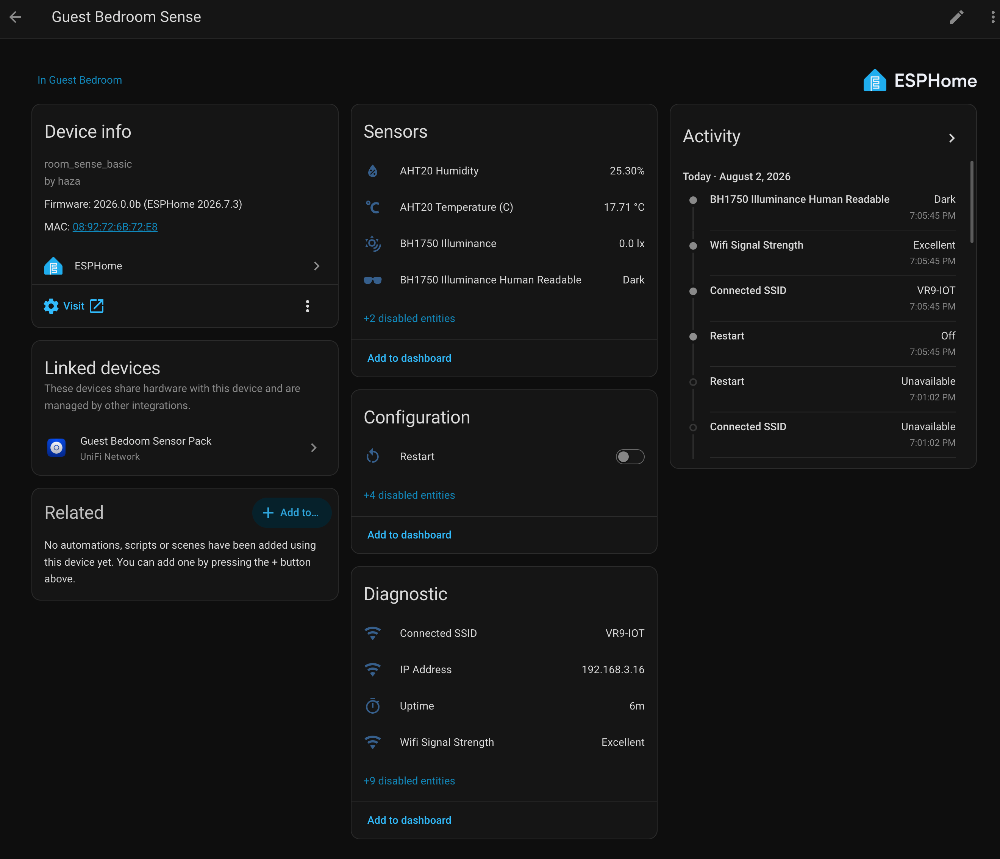

# HAZA Room Sense Basic

> [!WARNING]
> **Disclaimer:** These files are shared as-is, with the usual "it works in my
> environment" honesty baked in. They come from real builds, test
> devices, and ongoing experiments, but they are not guaranteed to work safely
> or correctly in your setup. Check the code, wiring, pins, power, secrets,
> calibration, and local rules and regulations before using anything. If it can
> switch mains power, move water, open a gate, affect safety, or ruin your
> afternoon, test it properly first.

`HAZA Room Sense Basic` is the first room-monitoring cookbook project for the
HAZA ESPHome Modular Framework.

It measures the simple environmental things that quietly shape how a room feels:
temperature, humidity, and light.

This version is based on a real private Room Sense Basic deployment. The public
recipe stays small so it can work as a clean starting point for other room
sensors.

## YouTube Video

To do, if this project is filmed.

## Current Status

- YAML recipe: `esphome_room_sense_basic_project.yaml`
- Config validation: Passed on ESPHome `2026.7.3`
- Compile validation: Passed on ESPHome `2026.7.3`
- Physical validation: Passed on `Room Sense Basic validation device`,
  2026-08-02
- Documentation approval: Draft, pending Pascal review

Full validation notes live in [validation.md](validation.md).

## Why Build This?

Most rooms are not uncomfortable all at once. They drift.

The room gets a little warmer, a little more humid, or a little darker, and by
the time you notice it you are already uncomfortable or the plants are already
having a less-than-great day.

This project gives Home Assistant a simple view of the room so later
automations have real values to work from.

## What Problems It Solves

- Shows the current temperature and humidity in a room.
- Shows how bright or dark the room is.
- Gives Home Assistant real values instead of guesses.
- Creates a reusable base for room comfort, plant care, and lighting logic.
- Gives us a small hardware-tested project to validate framework modules.

## What Possibilities It Creates

This project does not control anything by itself. It is the sensing layer.

Once the values are in Home Assistant, they can become inputs for things like:

- turning an air conditioner, heater, humidifier, or dehumidifier on and off
- understanding whether a room is comfortable at different times of day
- checking whether plants are sitting in useful light
- deciding when a blind, curtain, fan, or extractor might help
- feeding future Room Sense variants with air quality, particulate, or presence
  data

The Basic version keeps the first step small enough that it is easy to build,
test, and trust.

## What This Project Does

The device exposes:

- AHT20 temperature
- AHT20 humidity
- AHT20 calculated dew point
- BH1750 illuminance
- standard ESPHome diagnostic entities from the shared framework packages

## Who This Is For

Build this if you want a small room sensor that is easy to understand and easy
to extend.

It is especially useful if you are:

- learning ESPHome with reusable packages
- building a first HAZA room sensor
- starting a room comfort or plant-care automation
- validating the ESP32-C3 Super Mini as a low-power room node

Skip it, or use it only as a reference, if you need a polished commercial
device, battery operation, presence detection, eCO2/TVOC, or PM2.5 in this
version.

## Project Fit

| Factor | Rating | Notes |
| --- | --- | --- |
| Difficulty | Beginner to intermediate | Basic wiring, ESPHome compile/upload, and Home Assistant integration. |
| Estimated cost | Low | Uses a small ESP32-C3 board and two common I2C sensors. |
| Build time | 1-2 hours | Faster if the headers are already soldered and ESPHome is ready. |
| Tools needed | Basic plus soldering | USB cable, Dupont wires, breadboard or soldering tools, and a computer. |
| Off-the-shelf viability | Either | Buy if you want a finished product. Build if you want local control, repairability, and a base for variants. |
| Maintenance burden | Low | Check readings occasionally; no regular calibration is expected for Basic. |

## Project Shape

Initial public shape: **Repo-First**.

The project YAML pulls board, common, network, and sensor packages from the HAZA
framework. That keeps the device file small and makes the project easier to
repeat.

The first tested deployment was a private Room Sense Basic validation device.
That private deployment used the same package stack, with device-specific names
and fixed-IP networking.

## Hardware And Bill Of Materials

### Visual Reference

Add clean component photos here as they become available.

```text
[Image placeholder: ESP32-C3 Super Mini on a clean background]
[Image placeholder: AHT20 temperature and humidity sensor]
[Image placeholder: BH1750 illuminance sensor]
[Image placeholder: assembled Room Sense Basic validation device]
```

| Item | Recommended Part | Image | Viable Alternatives | Notes |
| --- | --- | --- | --- | --- |
| Controller | ESP32-C3 Super Mini | To do: `assets/esp32-c3-super-mini.png` | Other ESP32-C3 boards | Pin mapping and board package may change. |
| Temperature and humidity | AHT20 module | To do: `assets/aht20-sensor.png` | SHT40, BME280 | Alternatives need matching YAML packages and may expose different entities. |
| Illuminance | BH1750 module | To do: `assets/bh1750-sensor.png` | Other ESPHome-supported lux sensors | Wiring and package will change. |
| Wiring | Dupont leads or soldered wire | Optional build photo | JST/Grove/Qwiic if your modules support it | Keep power, ground, SDA, and SCL clear and consistent. |
| Mounting | Project box or printed enclosure | To do | Breadboard for testing | Keep sensor openings exposed to room air and light. |

## Wiring

Pascal will provide the Fritzing diagram for the final build.

```text
[Image placeholder: assets/wiring-breadboard.png]
```

Use the wiring table when checking the diagram.

| Component | Pin | Connects To | Notes |
| --- | --- | --- | --- |
| AHT20 | VCC | 3V3 | Use 3.3V unless your module explicitly supports another voltage. |
| AHT20 | GND | GND | Common ground with the ESP32-C3. |
| AHT20 | SDA | GPIO9 | I2C SDA from `boards/esp32/c3_super_mini.yaml`. |
| AHT20 | SCL | GPIO10 | I2C SCL from `boards/esp32/c3_super_mini.yaml`. |
| BH1750 | VCC | 3V3 | Use 3.3V unless your module explicitly supports another voltage. |
| BH1750 | GND | GND | Common ground with the ESP32-C3. |
| BH1750 | SDA | GPIO9 | Shared I2C bus. |
| BH1750 | SCL | GPIO10 | Shared I2C bus. |

Power and safety notes:

- Disconnect power before changing wiring.
- GPIO9 is a strapping pin on the ESP32-C3 Super Mini, so keep the wiring simple
  and check boot behavior after wiring.
- If I2C scanning does not find both sensors, check power, ground, SDA/SCL
  order, and sensor addresses first.
- Keep the AHT20 exposed to room air and the BH1750 exposed to representative
  room light.

## Framework Packages Used

- Board: `boards/esp32/c3_super_mini.yaml`
- Core: `common/core/settings.yaml`
- Time: `common/time/home_assistant.yaml`
- Network helpers: `common/network/wifi.yaml`
- Public recipe network: `common/network/wifi_dynamicip.yaml`
- Tested private deployment network: `common/network/wifi_fixedip.yaml`
- Web server: `common/network/webserver.yaml`
- Sensor: `sensors/i2c/bh1750.yaml`
- Sensor: `sensors/i2c/aht2x_3x.yaml`

## Setup

1. Copy or import the recipe YAML.
2. Set the device substitutions for your room.
3. Choose dynamic IP for a general public build, or fixed IP for your local
   deployment if that is how your network is managed.
4. Confirm `sample_secrets.yaml` has the required secret names in your own
   `secrets.yaml`.
5. Compile the firmware in ESPHome.
6. Upload the firmware.
7. Check the ESPHome web server.
8. Add or review the device in Home Assistant.

If you are replacing an existing ESPHome device, match any existing OTA password
for the first migration upload, or use web OTA/serial flashing.

## Home Assistant Entities

Expected user-facing entities:

- AHT20 Temperature (C)
- AHT20 Humidity
- AHT20 Dew Point
- BH1750 Illuminance
- BH1750 Illuminance Human Readable
- Uptime
- IP Address
- Connected SSID
- Wifi Signal Strength
- Status and diagnostic entities, depending on what Home Assistant shows by
  default

The exact entity IDs depend on the device substitutions used for the local
deployment.

## Screenshots And Visual Checks

### ESPHome Web Server


Use this screen to confirm the device is alive locally and the ESPHome-side
values look sensible before spending time debugging Home Assistant.

### Home Assistant Device Page



Use this screen to confirm the device integrated correctly and the expected
entities are visible in Home Assistant.

### Additional Images To Add

```text
[Image placeholder: close-up of assembled board and sensors]
[Image placeholder: device installed in the room]
[Image placeholder: Fritzing wiring diagram]
[Image placeholder: clean BOM component photos]
```

## Calibration And Tuning

No calibration is expected for the Basic version.

That said, sensor placement matters:

- Do not mount the AHT20 directly against a heat source.
- Do not trap the AHT20 in a sealed enclosure.
- Do not point the BH1750 at a light source unless that is the measurement you
  actually want.
- Compare readings with another trusted room sensor if the values feel wrong.

## Validation Evidence

See [validation.md](validation.md).

## Troubleshooting

See [troubleshooting.md](troubleshooting.md).

## Known Limitations

- This Basic version does not include eCO2, TVOC, PM2.5, movement, or presence.
- It has only been physically validated on one private Room Sense Basic
  deployment so far.
- The public recipe uses dynamic IP, while the tested private deployment used
  fixed IP.
- Component images and final wiring diagrams are still being added.

## Related Projects And Next Variants

- HAZA Room Sense Plus: Basic plus eCO2 and TVOC.
- HAZA Room Sense Air: Plus plus PM2.5 or particulate sensing.
- HAZA Room Sense Presence: movement and presence focused variant.
- HAZA Room Sense Max: reserved for the full combined room sensor.

TTP223 capacitive touch is intentionally not part of the Room Sense cookbook
line. It belongs in `recipes/samples/` unless it becomes a separate controller
project later.

## Change Notes

- 2026.0.1b: Reviewed Wi-Fi signal-strength labels against common RSSI guidance
  and compile-validated the update. OTA revalidation is still pending.
- 2026.0.1: Updated BH1750 human-readable illuminance labels and revalidated
  the change with a successful OTA reinstall.
- 2026.0.0: Drafted tutorial-style project documentation structure.
- 2026.0.0: Promoted the hardware-validated Room Sense Basic package stack out
  of beta status.
- 2026.0.0: Physical upload and live-value validation passed on a private Room
  Sense Basic validation device.
- 2026.0.0: Config and compile validation passed on ESPHome `2026.7.3`.
- 2026.0.0: Removed TTP223 and ENS160 from the Basic recipe scope.
