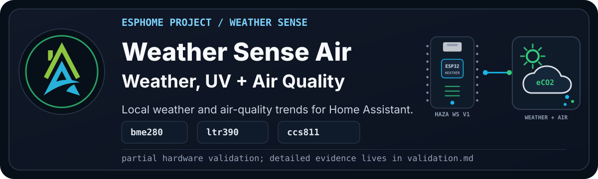

> [!WARNING]
> **Disclaimer:** This is Pascal's production-target pass of the older weather
> station rebuild. The hardware is based on the Open Green Energy Solar Powered
> WiFi Weather Station V3.0 project. Pascal converted the original C++ firmware
> idea to ESPHome, and this recipe keeps the HAZA staged bring-up pattern:
> prove one new part of the station at a time.

`HAZA Weather Sense Air` starts from Weather Sense Basic, uses the fitted LTR390
UV/ambient light sensor, and adds CCS811 eCO2 and TVOC sensing.

Wind and rain metering are intentionally not part of this Air variant. Those
belong to the future V4 weather-meter build, where the moving hardware can be
tested properly.

<details>

<summary><b>Current Status</b></summary><br>

- YAML recipe: `esphome_weather_sense_air_project.yaml`
- Desktop upload file: maintained in Pascal's local ESPHome Desktop workspace
- Board: `boards/esp32/haza_weather_station_v1.yaml`
- Current stage: Beta, partial hardware pass
- Config validation: Pass on ESPHome 2026.7.3 public recipe and Desktop file;
  Pascal revalidated the Desktop upload on ESPHome 2026.8.0 beta
- Compile validation: Pass on ESPHome 2026.7.3 public recipe and Desktop file;
  Pascal recompiled on ESPHome 2026.8.0 beta
- Physical validation: Serial push, log check, and web check passed on
  2026-08-22; CCS811 hardware detection remains unresolved
- Known correction: this station hardware uses LTR390 at `0x53`
- Known issue: CCS811 at `0x5A` did not appear in the I2C scan and was marked
  failed during setup
- Documentation approval: Draft, pending Pascal review

Full validation notes live in [validation.md](documents/validation.md).

</details>

## Project Profile

| Factor | Rating | Notes |
| --- | --- | --- |
| Difficulty | Intermediate | Combines I2C, 1-Wire, ADC, time, sun, and air-quality sensing. |
| Estimated cost | Medium | Much cheaper if the Open Green Energy style station hardware is already built. |
| Build time | 1-2 hours | More if the outdoor wiring, enclosure, or sensor board needs repair. |
| Tools needed | Multimeter and USB serial | CCS811 bring-up mostly needs wiring, I2C scan, and runtime checks. |
| Off-the-shelf viability | Either | Buy if you need polished weather data quickly; build if local control and repairability matter. |
| Maintenance burden | Medium | Outdoor sensors need checking, cleaning, and occasional calibration. |

## Why Build This?

Weather Sense Air is the practical production candidate for the current station
hardware. It keeps the quiet environmental sensors and adds a simple air-quality
signal without mixing in the wind and rain hardware that we already know needs a
proper V4 test path.

The goal is to prove the actual board, time, sun, BME280, DS18B20, LTR390,
battery, and CCS811 stack together on one real ESPHome device.

## What Problems It Solves

- Uses the correct LTR390 UV and ambient light sensor for this board.
- Adds CCS811 eCO2 and TVOC readings to the weather station.
- Keeps the production candidate focused and easier to validate.
- Avoids treating wind and rain fields as validated before the hardware is
  properly tested.

## What Possibilities It Creates

Once this is stable, the station can support outdoor condition tracking, heat
and UV awareness, rough air-quality trend tracking, and future garden or
ventilation decisions.

It also gives the framework a cleaner staged pattern: Basic first, Air for
environment plus air quality, and V4 later for the moving weather-meter parts.

## Hardware And Bill Of Materials

| Item | Recommended Part | Image | Viable Alternatives | Notes |
| --- | --- | --- | --- | --- |
| Controller | HAZA Weather Station Board v1 | To do: `assets/haza-weather-station-board-v1.png` | ESP32 DevKit style board with matching pins | This recipe uses Pascal's converted station hardware package. |
| Temperature, humidity, and pressure | BME280 module | To do: `assets/bme280-sensor.png` | BMP280 only if humidity is not needed | BMP280 needs a different project decision because it drops humidity. |
| External temperature | DS18B20 waterproof probe | To do: `assets/ds18b20-probe.png` | Other waterproof temperature sensors | The 1-Wire address may need to be updated. |
| UV and ambient light | LTR390 module | To do: `assets/ltr390-sensor.png` | Other UV/light modules as future variants | This board uses LTR390 at `0x53`. |
| Air quality | CCS811 module | To do: `assets/ccs811-sensor.png` | ENS160 or SGP30 as separate variants | This Air build uses CCS811 at `0x5A`. |
| Battery monitoring | Voltage divider into ESP32 ADC | To do: `assets/battery-voltage-divider.png` | Dedicated fuel gauge module | The percentage estimate must be calibrated to the actual divider and battery. |

> [!WARNING]
> Alternatives are not automatically drop-in replacements. Check I2C addresses,
> voltage, warm-up behaviour, package changes, placement, and interpretation.
> The CCS811 in this build has not yet been detected on the hardware bus.

## Who This Is For

Build this if you want to repair or extend the current station with local UV,
environmental, and rough gas-trend data. Treat the CCS811 stage as active
troubleshooting, not a finished capability. Buy a calibrated outdoor monitor
if reliable air-quality measurements are the main requirement.

## Wiring

Pascal will provide the final wiring diagram after the Air hardware pass.

```text
[Image placeholder: assets/wiring-breadboard.png]
```

Current expected wiring from the historical build:

| Component | Pin | Connects To | Notes |
| --- | --- | --- | --- |
| BME280 | SDA | GPIO21 | Shared I2C bus. |
| BME280 | SCL | GPIO22 | Shared I2C bus. |
| LTR390 | SDA | GPIO21 | Shared I2C bus. |
| LTR390 | SCL | GPIO22 | Shared I2C bus. |
| CCS811 | SDA | GPIO21 | Shared I2C bus. |
| CCS811 | SCL | GPIO22 | Shared I2C bus. |
| DS18B20 | DATA | GPIO4 | Uses the 1-Wire package. |
| Battery divider | OUT | GPIO33 | Must be calibrated to the actual divider. |

Expected I2C addresses:

- LTR390: `0x53`
- BME280: `0x76`
- CCS811: `0x5A`

## Setup

Before compiling, set these substitutions for the real deployment:

- `location_latitude`
- `location_longitude`
- `ds18b20_address`
- `battery_empty_voltage`
- `battery_full_voltage`
- `ccs811_i2c_address`

The default CCS811 address is `0x5A`. If the I2C scan does not show that
address, check power, wiring, and whether the module is using a different
address before treating the YAML as failed.

Validate and compile the recipe before uploading it. For a new or repurposed
board, follow [First Firmware Upload](https://github.com/homeautomatorza/ESPHome-Modules/wiki/first-firmware-upload).
Use the I2C scan, logs, and web server to confirm each sensor before adding or
reviewing the device in Home Assistant.

<details>

<summary><b>Framework Packages Used</b></summary><br>

- Board: `boards/esp32/haza_weather_station_v1.yaml`
- Core: `common/core/settings.yaml`
- Time: `common/time/sntp.yaml`
- Sun: `common/core/sun.yaml`
- Network helpers: `common/network/wifi.yaml`
- Public recipe network: `common/network/wifi_dynamicip.yaml`
- Web server: `common/network/webserver.yaml`
- Sensor: `sensors/i2c/bme280.yaml`
- Sensor: `sensors/one_wire/ds18b20.yaml`
- Sensor: `sensors/i2c/ltr390.yaml`
- Sensor: `sensors/i2c/ccs811.yaml`

</details>

## Visual Checks

To add during documentation cleanup:

```text
[Image placeholder: assets/weather-sense-air-web-server.png]
[Image placeholder: Home Assistant device page for Weather Sense Air]
[Image placeholder: I2C scan or log evidence showing LTR390/BME280/CCS811]
[Image placeholder: close-up of the LTR390 and CCS811 wiring]
[Image placeholder: Fritzing wiring diagram]
```

## Home Assistant Entities

<details>

<summary><b>Expected user-facing entities</b></summary><br>

Expected user-facing entities for this stage:

- BME280 Temperature (C)
- BME280 Humidity
- BME280 Atmospheric Pressure
- BME280 Dew Point
- DS18B20 Temperature
- LTR390 UV Index
- LTR390 UV Sensor
- LTR390 Light
- LTR390 Ambient Light
- LTR390 Illuminance Human Readable
- LTR390 UV Exposure Level
- CCS811 eCO2
- CCS811 eCO2 Classification
- CCS811 TVOC
- CCS811 TVOC Level
- CCS811 Version
- Battery Voltage
- Battery Percentage
- Sun Azimuth
- Sun Elevation
- Sun Next Sunrise
- Sun Next Sunset

The exact entity IDs depend on the device substitutions used for the local
deployment.

</details>

## Calibration And Tuning

CCS811 readings should be treated as trend and classification signals, not lab
measurements. The module can use a measured baseline later, but this first Air
pass is about proving that the sensor boots, publishes readings, and updates
the human-readable labels.

Battery percentage depends on the real divider and battery range. Treat the
default values as Pascal's current build values, not universal values.

## Validation Evidence

See [validation.md](documents/validation.md).

## Troubleshooting

See [troubleshooting.md](documents/troubleshooting.md).

## Changelog

See [changelog.md](documents/changelog.md).

## Credits And Source Hardware

This project is built around the Open Green Energy Solar Powered WiFi Weather
Station V3.0 hardware design:

- <https://www.opengreenenergy.com/solar-powered-wifi-weather-station-v3-0/>

The original project uses C++ firmware. This HAZA version is Pascal's ESPHome
conversion, split into reusable board, sensor, common, and project packages so
the station can be rebuilt and validated one stage at a time.

## Related Projects And Next Variants

- Weather Sense Basic: static station baseline.
- Weather Sense Air: current production target with LTR390 and CCS811.
- Weather Sense Wind and Rain: staged experiment for the historical wind/rain
  wiring, not the near-term production target.
- Weather Sense V4.0: future branch for wind and rain based on the Open Green
  Energy / PCBWay V4.0 design.
- Pascal Weather Sense: future branch based on Pascal's own board design.
