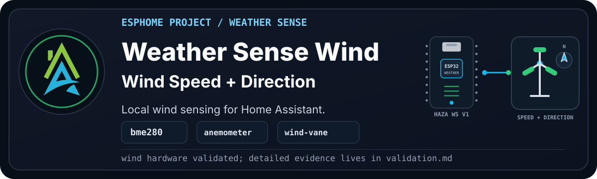

> [!WARNING]
> **Disclaimer:** This is the wind-stage modular pass of Pascal's older weather
> station. The hardware is based on the Open Green Energy Solar Powered WiFi
> Weather Station V3.0 project. Pascal converted the original C++ firmware idea
> to ESPHome for his own build, and this recipe keeps the same staged HAZA
> approach: first prove the quiet baseline, then add the moving wind hardware.

`HAZA Weather Sense Wind` starts from Weather Sense Basic and adds the two wind
inputs from the historical station: an anemometer for speed and a resistor-ladder
wind vane for direction.

Rain can wait its turn. Moving parts get their own moment.

<details>

<summary><b>Current Status</b></summary><br>

- YAML recipe: `esphome_weather_sense_wind_project.yaml`
- Board: `boards/esp32/haza_weather_station_v1.yaml`
- Current stage: Beta, hardware tested; light/UV package corrected
- Config validation: Pass, ESPHome 2026.7.3 and ESPHome 2026.8 beta
- Compile validation: Pass, ESPHome 2026.7.3 and ESPHome 2026.8 beta
- Physical validation: Partial pass, revalidated with ESPHome 2026.8 beta on
  2026-08-22
- Live validation: Partial pass, logs and web server confirmed; light/UV package
  corrected to LTR390 after the board was confirmed to use address `0x53`
- Documentation approval: Draft, pending Pascal review

Full validation notes live in [validation.md](documents/validation.md).

</details>

## Project Profile

| Factor | Rating | Notes |
| --- | --- | --- |
| Difficulty | Intermediate | Adds moving outdoor sensors and an ADC direction ladder. |
| Estimated cost | Medium | Cheaper if the Open Green Energy style sensor set is already built. |
| Build time | 1-2 hours | More if the wind cups or vane wiring need repair. |
| Tools needed | Soldering and multimeter | A fan or gentle manual spin helps with bench testing. |
| Off-the-shelf viability | Either | Buy if you need calibrated wind data quickly; build if repairability and local control matter. |
| Maintenance burden | Medium | Wind cups, bearings, cables, and outdoor connectors need periodic checks. |

## Why Build This?

Wind is the first outdoor moving-sensor stage. It is also where weather stations
start becoming interesting instead of just reporting room-like environmental
data in a box.

This project gives us a clean place to validate the anemometer pulse input and
wind-vane ADC ladder without also debugging rain, UV, particulate matter, or the
rest of the old flat configuration.

## What Problems It Solves

This stage answers the next weather-station questions:

- Is the anemometer pulse input wired and counting?
- Does the wind speed conversion produce plausible values?
- Is the wind vane ADC connected to the expected pin?
- Do the resistance bands map to sensible compass headings?
- Does the Beaufort text helper update from the average wind speed?

## What Possibilities It Creates

Once wind is reliable, the station can start feeding better local weather
history. It can also support practical automations later, such as pausing
irrigation when the wind is too strong, flagging stormy conditions, or comparing
local wind to public weather forecasts.

## Hardware And Bill Of Materials

| Item | Recommended Part | Image | Viable Alternatives | Notes |
| --- | --- | --- | --- | --- |
| Controller | HAZA Weather Station Board v1 | To do: `assets/haza-weather-station-board-v1.png` | ESP32 DevKit style board with matching pins | This recipe uses Pascal's converted station hardware package. |
| Temperature, humidity, and pressure | BME280 module | To do: `assets/bme280-sensor.png` | BMP280 | BMP280 does not expose humidity and needs a different project decision. |
| External temperature | DS18B20 waterproof probe | To do: `assets/ds18b20-probe.png` | Other waterproof temperature sensors | The 1-Wire address may need to be updated. |
| UV and ambient light | LTR390 module | To do: `assets/ltr390-sensor.png` | BH1750 for illuminance-only builds | This weather station board uses LTR390 at `0x53`; BH1750 is not fitted here. |
| Battery monitoring | Voltage divider into ESP32 ADC | To do: `assets/battery-voltage-divider.png` | Dedicated fuel gauge module | The percentage estimate must be calibrated to the actual divider and battery. |
| Wind speed | SparkFun-style anemometer | To do: `assets/anemometer.png` | Other pulse-output anemometers | Conversion factor may need recalibration. |
| Wind direction | SparkFun-style wind vane | To do: `assets/wind-vane.png` | Other resistor-ladder wind vanes | Resistance bands may need tuning for the exact hardware. |

> [!WARNING]
> Alternatives are not automatically drop-in replacements. Wind sensors can
> use different pulse rates, resistance bands, voltages, and mounting methods.
> Recheck the package, pins, calibration, and live values after any change.

## Who This Is For

Build this if you want repairable, local wind readings and are prepared to test
moving outdoor hardware. Start with Weather Sense Basic if the station baseline
is not stable yet, or buy a calibrated unit if dependable wind data matters
more than customisation.

## Wiring

Pascal will provide the final wiring diagram after the wind hardware is back on
the bench.

```text
[Image placeholder: assets/wiring-breadboard.png]
```

Current expected wiring from the historical build:

| Component | Pin | Connects To | Notes |
| --- | --- | --- | --- |
| BME280 | SDA | GPIO21 | Shared I2C bus. |
| BME280 | SCL | GPIO22 | Shared I2C bus. |
| BME280 | VCC | 3V3 | Check the module voltage. |
| BME280 | GND | GND | Common ground. |
| LTR390 | SDA | GPIO21 | Shared I2C bus. |
| LTR390 | SCL | GPIO22 | Shared I2C bus. |
| LTR390 | VCC | 3V3 | Check the module voltage. |
| LTR390 | GND | GND | Common ground. |
| DS18B20 | DATA | GPIO4 | Uses the 1-Wire package. |
| Battery divider | OUT | GPIO33 | Must be calibrated to the actual divider. |
| Anemometer | Signal | GPIO14 | Pulse input for wind speed. |
| Wind vane | ADC OUT | GPIO35 | ADC input for wind direction resistance ladder. |

Expected I2C addresses:

- LTR390: `0x53`
- BME280: `0x76`

## Setup

Before compiling, set these substitutions for the real deployment:

- `location_latitude`
- `location_longitude`
- `ds18b20_address`
- `battery_empty_voltage`
- `battery_full_voltage`
- `wind_speed_pin`
- `wind_vane_pin`

The public recipe uses safe placeholder coordinates. Do not treat them as
Pascal's location or as your own location.

Then validate and compile the recipe. For a new or repurposed board, follow
[First Firmware Upload](https://github.com/homeautomatorza/ESPHome-Modules/wiki/first-firmware-upload),
then check the logs and web server. Test several vane positions and wind-cup
speeds before adding or reviewing the device in Home Assistant.

<details>

<summary><b>Framework Packages Used</b></summary><br>

- Board: `boards/esp32/haza_weather_station_v1.yaml`
- Core: `common/core/settings.yaml`
- Time: `common/time/home_assistant.yaml`
- Sun: `common/core/sun.yaml`
- Network helpers: `common/network/wifi.yaml`
- Public recipe network: `common/network/wifi_dynamicip.yaml`
- Web server: `common/network/webserver.yaml`
- Sensor: `sensors/i2c/bme280.yaml`
- Sensor: `sensors/one_wire/ds18b20.yaml`
- Sensor: `sensors/i2c/ltr390.yaml`
- Sensor: `sensors/analogue/sparkfun_anemometer.yaml`
- Sensor: `sensors/analogue/sparkfun_wind_vane.yaml`

</details>

## Validation So Far

Alfred validated the modular YAML locally with ESPHome 2026.7.3:

- Config: pass
- Compile: pass
- Firmware size: 1,091,119 bytes
- RAM: 28.0%
- Flash: 59.5%

Pascal then tested and revalidated the Desktop deployment on hardware with
ESPHome 2026.8 beta on 2026-08-22:

- Compile: pass
- Serial push: pass
- Log check: pass
- ESPHome web server check: pass; screenshot supplied in the working thread
- Wind speed: live pulse counter values confirmed in the web log
- Beaufort Wind Scale: live value confirmed
- Wind direction: one live direction/heading value confirmed
- Correction from this pass: this station hardware uses LTR390 at `0x53`, not
  BH1750 at `0x23`
- Cleanup from this pass: added missing icons for wind direction, wind heading,
  BME280 raw pressure, and the wind-vane ADC helper

ESPHome warns that GPIO2 is a strapping pin. That matches the historical board
definition and the Basic stage.

## Visual Checks

To add during documentation cleanup:

```text
[Image placeholder: assets/weather-sense-wind-web-server.png]
[Image placeholder: Home Assistant device page for Weather Sense Wind]
[Image placeholder: wind speed changing during fan/manual spin test]
[Image placeholder: wind direction changing by vane position]
[Image placeholder: close-up of the board, anemometer, and wind vane wiring]
[Image placeholder: Fritzing wiring diagram]
```

## Home Assistant Entities

<details>

<summary><b>Expected user-facing entities</b></summary><br>

Expected user-facing entities for this stage:

- all Weather Sense Basic entities
- Wind Speed (KPH)
- Wind Speed (MPH)
- Wind Speed (Knots)
- Wind Speed Average (KPH)
- Wind Speed Average (MPH)
- Wind Speed Average (Knots)
- Beaufort Wind Scale
- Wind Heading
- Wind Cardinal Direction

The exact entity IDs depend on the device substitutions used for the local
deployment.

</details>

## Calibration And Tuning

Wind speed uses the existing SparkFun anemometer package conversion. Treat the
first hardware pass as a sanity check, not final calibration.

Wind direction depends on resistance ranges. If the cardinal direction is wrong,
we should log the raw resistance values by vane position and tune the bands.

Battery percentage remains an estimate until the voltage divider and battery
range are checked on the real station.

## Validation Evidence

See [validation.md](documents/validation.md).

## Troubleshooting

See [troubleshooting.md](documents/troubleshooting.md).

## Changelog

See [changelog.md](documents/changelog.md).

## Credits And Source Hardware

This project is built around the Open Green Energy Solar Powered WiFi Weather
Station V3.0 hardware design:

- <https://www.opengreenenergy.com/solar-powered-wifi-weather-station-v3-0/>

The original project uses C++ firmware. This HAZA version is Pascal's ESPHome
conversion, split into reusable board, sensor, common, and project packages so
the station can be rebuilt and validated one stage at a time.

## Related Projects And Next Variants

- Weather Sense Basic: static station baseline.
- Weather Sense Wind and Rain: adds the tipping-bucket rain gauge.
- Weather Sense Air: current production target with CCS811 eCO2 and TVOC.
- Weather Sense V4.0: future branch based on the Open Green Energy / PCBWay
  V4.0 design.
- Pascal Weather Sense: future branch based on Pascal's own board design.
