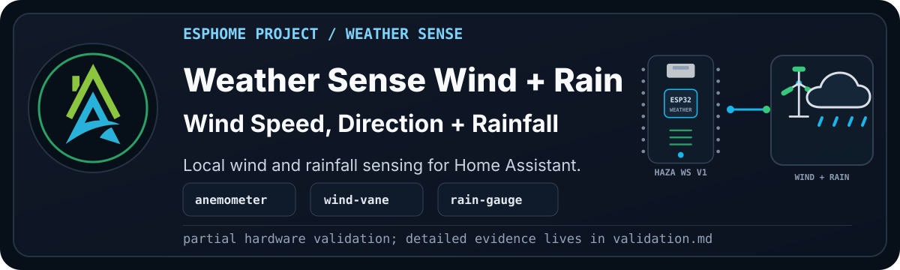

> [!WARNING]
> **Disclaimer:** This is the wind-and-rain modular pass of Pascal's older
> weather station. The hardware is based on the Open Green Energy Solar Powered
> WiFi Weather Station V3.0 project. Pascal converted the original C++ firmware
> idea to ESPHome for his own build, and this recipe keeps the HAZA staged
> bring-up pattern: prove one new part of the station at a time.

`HAZA Weather Sense Wind and Rain` starts from Weather Sense Wind and adds the
tipping-bucket rain gauge on `GPIO25`.

Wind is already part of the station at this point. The new thing to prove here
is rain: does the bucket tip, does the ESP32 count it, and do the rainfall
numbers look sane?

<details>

<summary><b>Current Status</b></summary><br>

- YAML recipe: `esphome_weather_sense_wind_and_rain_project.yaml`
- Board: `boards/esp32/haza_weather_station_v1.yaml`
- Current stage: Beta, runtime-visible but rain bucket test deferred
- Config validation: Pass on ESPHome 2026.7.3 and ESPHome 2026.8.0 Desktop
- Compile validation: Pass on ESPHome 2026.7.3 public recipe and ESPHome 2026.8.0 Desktop
- Physical validation: Serial upload, log check, and web check passed on Pascal's validation device
- Rain hardware validation: Deferred to the future V4 hardware build
- Known correction: this station hardware uses LTR390 at `0x53`, not BH1750
- Documentation approval: Draft, pending Pascal review

Full validation notes live in [validation.md](documents/validation.md).

</details>

## Project Profile

| Factor | Rating | Notes |
| --- | --- | --- |
| Difficulty | Intermediate | Adds a reed-switch rain gauge and calibration value. |
| Estimated cost | Medium | Cheaper if the Open Green Energy style weather meter set is already built. |
| Build time | 1-2 hours | More if the outdoor cable, RJ connector, or bucket mechanism needs repair. |
| Tools needed | Multimeter and manual tip test | A small amount of water or manual bucket tipping is enough for bring-up. |
| Off-the-shelf viability | Either | Buy if you need calibrated rainfall quickly; build if repairability and local control matter. |
| Maintenance burden | Medium | Rain gauges need cleaning, levelling, and occasional calibration checks. |

## Why Build This?

Rain is where the station starts becoming useful for garden, irrigation, and
outdoor planning decisions. Temperature and wind tell us what the weather feels
like; rain tells us what actually reached this spot.

This variant keeps the test focused. If the rain gauge behaves, we can validate
the module and move on to air quality. If it bounces, misses tips, or reports
strange totals, we know exactly where to look.

## What Problems It Solves

- Confirms the tipping-bucket rain gauge is wired to the expected GPIO.
- Checks whether the ESPHome pulse counter sees bucket tips.
- Gives a rainfall rate for live testing.
- Gives a total rainfall value since boot/reset.
- Keeps rain calibration separate from the later CCS811 air-quality stage.

## What Possibilities It Creates

Once rainfall is reliable, the station can support local rain history, garden
watering decisions, storm notes, and later irrigation automation. It can also
help compare "official" weather with what happened in Pascal's own garden.

## Hardware And Bill Of Materials

| Item | Recommended Part | Image | Viable Alternatives | Notes |
| --- | --- | --- | --- | --- |
| Controller | HAZA Weather Station Board v1 | To do: `assets/haza-weather-station-board-v1.png` | ESP32 DevKit style board with matching pins | This recipe uses Pascal's converted station hardware package. |
| Temperature, humidity, and pressure | BME280 module | To do: `assets/bme280-sensor.png` | BMP280 | BMP280 does not expose humidity and needs a different project decision. |
| External temperature | DS18B20 waterproof probe | To do: `assets/ds18b20-probe.png` | Other waterproof temperature sensors | The 1-Wire address may need to be updated. |
| UV and ambient light | LTR390 module | To do: `assets/ltr390-sensor.png` | BH1750 for illuminance-only builds | This weather station board uses LTR390 at `0x53`; BH1750 is not fitted here. |
| Battery monitoring | Voltage divider into ESP32 ADC | To do: `assets/battery-voltage-divider.png` | Dedicated fuel gauge module | The percentage estimate must be calibrated to the actual divider and battery. |
| Wind speed | SparkFun-style anemometer | To do: `assets/anemometer.png` | Other pulse-output anemometers | Inherited from Weather Sense Wind. |
| Wind direction | SparkFun-style wind vane | To do: `assets/wind-vane.png` | Other resistor-ladder wind vanes | Inherited from Weather Sense Wind. |
| Rainfall | SparkFun-style tipping-bucket rain gauge | To do: `assets/rain-gauge.png` | Other reed-switch tipping-bucket gauges | Update `rain_gauge_tip_mm` if the bucket size differs. |

> [!WARNING]
> Alternatives are not automatically drop-in replacements. Check pulse rates,
> resistance bands, GPIO logic, voltage, package changes, and calibration.
> The rain bucket in this build is still awaiting its dedicated hardware test.

## Who This Is For

Build this if the Basic and Wind stages are already understood and you want
local rainfall data you can calibrate and repair. Use the earlier variants if
rain is not needed, or buy a calibrated station if finished outdoor hardware
and dependable rainfall totals are the priority.

## Wiring

Pascal will provide the final wiring diagram after the rain hardware is checked.

```text
[Image placeholder: assets/wiring-breadboard.png]
```

Current expected wiring from the historical build:

| Component | Pin | Connects To | Notes |
| --- | --- | --- | --- |
| BME280 | SDA | GPIO21 | Shared I2C bus. |
| BME280 | SCL | GPIO22 | Shared I2C bus. |
| LTR390 | SDA | GPIO21 | Shared I2C bus. |
| LTR390 | SCL | GPIO22 | Shared I2C bus. |
| DS18B20 | DATA | GPIO4 | Uses the 1-Wire package. |
| Battery divider | OUT | GPIO33 | Must be calibrated to the actual divider. |
| Anemometer | Signal | GPIO14 | Pulse input for wind speed. |
| Wind vane | ADC OUT | GPIO35 | ADC input for wind direction resistance ladder. |
| Rain gauge | Signal | GPIO25 | Reed/contact input with pull-up and bounce filtering. |

Expected I2C addresses:

- LTR390: `0x53`
- BME280: `0x76`

## Setup

Before compiling, set these substitutions for the real deployment:

- `location_latitude`
- `location_longitude`
- `ds18b20_address`
- `battery_empty_voltage`
- `battery_full_voltage`
- `wind_speed_pin`
- `wind_vane_pin`
- `rain_gauge_pin`
- `rain_gauge_tip_mm`

The default SparkFun-style rain gauge calibration is `0.2794` mm per bucket tip.
Treat that as a starting point. A manual rain gauge is the sensible way to tune
it later.

Validate and compile the recipe before uploading it. For a new or repurposed
board, follow [First Firmware Upload](https://github.com/homeautomatorza/ESPHome-Modules/wiki/first-firmware-upload).
Check logs and the web server, manually tip the bucket during the dedicated
hardware test, and only then review the device in Home Assistant.

<details>

<summary><b>Framework Packages Used</b></summary><br>

- Board: `boards/esp32/haza_weather_station_v1.yaml`
- Core: `common/core/settings.yaml`
- Time: `common/time/sntp.yaml`
- Sun: `common/core/sun.yaml`
- Network helpers: `common/network/wifi.yaml`
- Public recipe network: `common/network/wifi_dynamicip.yaml`
- Web server: `common/network/webserver.yaml`
- Sensor: `sensors/i2c/bme280.yaml`
- Sensor: `sensors/one_wire/ds18b20.yaml`
- Sensor: `sensors/i2c/ltr390.yaml`
- Sensor: `sensors/analogue/sparkfun_anemometer.yaml`
- Sensor: `sensors/analogue/sparkfun_wind_vane.yaml`
- Sensor: `sensors/analogue/sparkfun_rain_gauge.yaml`

</details>

## Visual Checks

To add during documentation cleanup:

```text
[Image placeholder: assets/weather-sense-wind-and-rain-web-server.png]
[Image placeholder: Home Assistant device page for Weather Sense Wind and Rain]
[Image placeholder: future rain bucket manual-tip log evidence]
[Image placeholder: close-up of the rain gauge wiring]
[Image placeholder: Fritzing wiring diagram]
```

## Home Assistant Entities

<details>

<summary><b>Expected user-facing entities</b></summary><br>

Expected user-facing entities for this stage:

- all Weather Sense Wind entities
- Rainfall Rate
- Rainfall Rate Hourly
- Total Rainfall

The exact entity IDs depend on the device substitutions used for the local
deployment.

</details>

## Calibration And Tuning

Rainfall depends on the bucket size and switch behaviour. The package defaults
to `0.2794` mm per tip and uses a `100ms` internal filter to reduce switch
bounce.

For the first hardware pass, a manual tip test is enough. For real calibration,
compare the reported total against a manual rain gauge after a few rain events.

## Validation Evidence

See [validation.md](documents/validation.md).

## Troubleshooting

See [troubleshooting.md](documents/troubleshooting.md).

## Changelog

See [changelog.md](documents/changelog.md).

## Credits And Source Hardware

This project is built around the Open Green Energy Solar Powered WiFi Weather
Station V3.0 hardware design:

- <https://www.opengreenenergy.com/solar-powered-wifi-weather-station-v3-0/>

The original project uses C++ firmware. This HAZA version is Pascal's ESPHome
conversion, split into reusable board, sensor, common, and project packages so
the station can be rebuilt and validated one stage at a time.

## Related Projects And Next Variants

- Weather Sense Basic: static station baseline.
- Weather Sense Wind: adds the anemometer and wind vane.
- Weather Sense Wind and Rain: adds the tipping-bucket rain gauge.
- Weather Sense Air: current production target with CCS811 eCO2 and TVOC.
- Weather Sense V4.0: future branch based on the Open Green Energy / PCBWay
  V4.0 design.
- Pascal Weather Sense: future branch based on Pascal's own board design.
