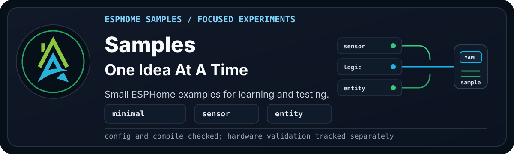

  

> [!WARNING]
> **Disclaimer:** These files are shared as-is, with the usual "it works in my
> environment" honesty baked in. They come from real builds, test
> devices, and ongoing experiments, but they are not guaranteed to work safely
> or correctly in your setup. Check the code, wiring, pins, power, secrets,
> calibration, and local rules and regulations before using anything. If it can
> switch mains power, move water, open a gate, affect safety, or ruin your
> afternoon, test it properly first.

Samples are small, focused ESPHome examples that show one idea at a time.

Use these to learn from one idea without adopting a complete project structure.
They may still depend on framework packages, specific hardware, or entities
created by another package in the same device file.

## Available and Future Samples

These samples are for trying a sensor and other ideas without turning it into a full
cookbook project.

| Sample | Status | Folder | What It Demonstrates |
| --- | --- | --- | --- |
| Earth Tremour Detection | Experimental | [earth_tremour](earth_tremour/README.md) | MPU6050 movement-delta detection using globals, a template binary sensor, and an interval update. |

## Sample Notes

- They may depend on a board, sensor, or common package already being present.
- They usually demonstrate one ESPHome pattern or one sensor idea.
- They may not include full wiring, bill of materials, screenshots, or Home
  Assistant walkthroughs.
- They should clearly state validation status before being used as a build
  reference.

> [!NOTE]
> If a sample is marked experimental, treat it as a starting point for testing,
> not a finished recipe.
