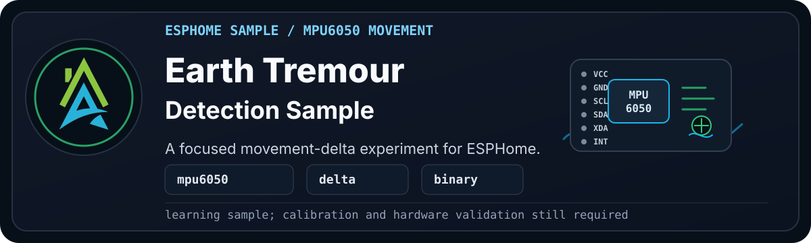

<p align="center">
  
</p>

> [!WARNING]
> **Disclaimer:** These files are shared as-is, with the usual "it works in my
> environment" honesty baked in. They come from real builds, test
> devices, and ongoing experiments, but they are not guaranteed to work safely
> or correctly in your setup. Check the code, wiring, pins, power, secrets,
> calibration, and local rules and regulations before using anything. If it can
> switch mains power, move water, open a gate, affect safety, or ruin your
> afternoon, test it properly first.

Earth Tremour Detection is a small ESPHome sample that watches movement from an
MPU6050 accelerometer and raises a template binary sensor when the movement
delta crosses a simple threshold.

> [!CAUTION]
> This is a learning sample, not a calibrated earthquake, safety, insurance,
> emergency, or structural monitoring tool.

## Current Status

| Check | Status |
| --- | --- |
| Sample YAML | [earth_tremour.yaml](earth_tremour.yaml) |
| Config validation | Not tested |
| Compile validation | Not tested |
| Hardware validation | Not yet |
| Validation status | Experimental |

## What This Sample Demonstrates

- Reusing values exposed by the `sensors/i2c/mpu6050.yaml` package.
- Storing previous accelerometer values with ESPHome globals.
- Comparing movement deltas in a template binary sensor.
- Updating the stored values on a fixed interval.

## Requirements

- An ESPHome device with an MPU6050 connected over I2C.
- The `sensors/i2c/mpu6050.yaml` package included before this sample.
- A device name substitution called `device_internal_name`.

## Minimal Usage

Add the MPU6050 package first, then include this sample in the same device file:

```yaml
packages:
  mpu6050: !include
    file: sensors/i2c/mpu6050.yaml
    vars:
      i2c_address: 0x68

  earth_tremour: !include recipes/samples/earth_tremour/earth_tremour.yaml
```

The sample expects the MPU6050 package to create accelerometer entity IDs using
the same `device_internal_name` substitution.

## Expected Entities

- `Earth Tremour Detected`

The binary sensor is disabled by default. Enable it in Home Assistant if you
want to watch the experiment while testing.

## Tuning

The movement threshold currently starts at `0.4`. Treat that as an experiment,
not a calibrated value. If the sample is too sensitive or not sensitive enough,
adjust the threshold in `earth_tremour.yaml` and retest on your own hardware.
